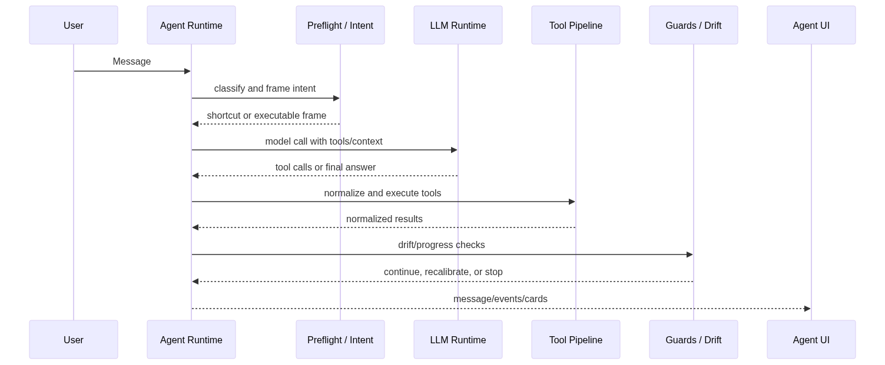
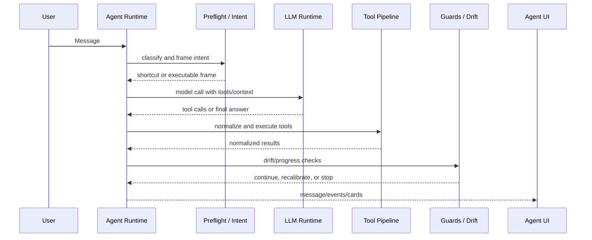
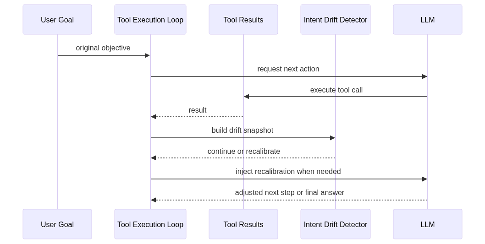
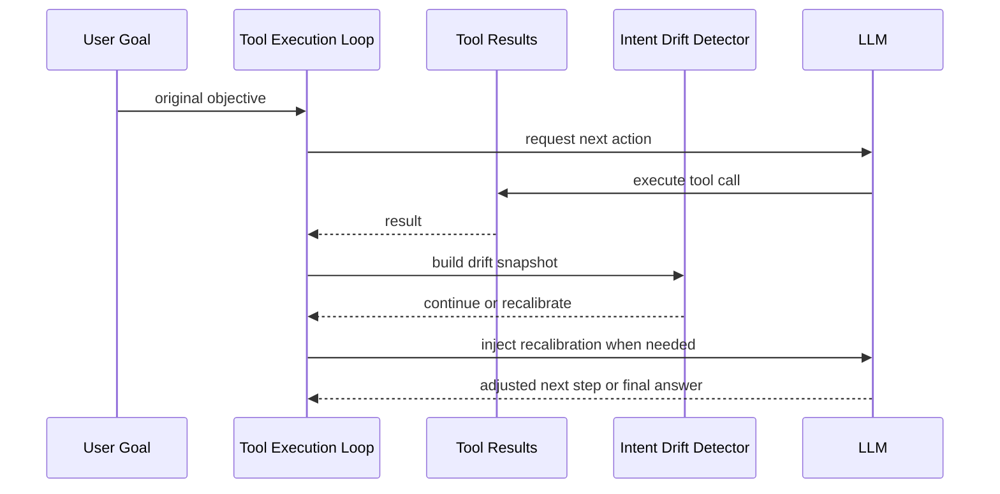

# The Agent Harness: Bounded Tool Execution

Redbit's `Agent Runtime` (`src/agents/`) is not just a chat loop. It wraps model calls in preflight routing, model capability resolution, tool definition assembly, execution guards, result normalization, and drift checks so that the UI can treat agent actions as inspectable product workflows instead of opaque model output.

## Agent Model Runtime Profiles

The main agent no longer assumes every configured describe model has the same capabilities. Runtime selection is centralized in `src/agents/modelResolver.ts` and `src/agents/agentModelRuntime.ts`:

- built-in Gemini and OpenAI describe models use catalog-backed capability metadata;
- independent custom describe endpoints can be probed from Settings with an explicit `gemini`, `openai-compatible`, or `anthropic` protocol;
- Settings provides a provider-first onboarding layer for OpenAI, Anthropic, Gemini, DeepSeek, OpenRouter, Groq, SiliconFlow, and custom OpenAI-compatible endpoints, filling protocol/base URL/recommended starter models before users drop into advanced fields;
- provider model discovery calls each provider's `/models`-style endpoint when available, then lets users quick-pick a returned model ID while preserving manual model ID fallback for relays or providers without discovery support;
- successful probes are stored locally as endpoint-scoped profiles keyed by model, protocol, relay/direct runtime, and endpoint fingerprint;
- failed required probe steps do not save a profile, so a broken custom model cannot silently become the agent default;
- vision injection uses the resolved runtime/profile capability, not model-name heuristics, so custom endpoints that do not support images are not sent visual payloads.

This lets the agent use catalog models such as Gemini and GPT-family models, Claude models through Anthropic's native Messages API, and mainstream OpenAI-compatible providers when probe results prove the required chat/system/tool/JSON behavior.

## Intent Routing and Preflight

`src/agents/preFlightRouter.ts`, `src/agents/unifiedIntentRouter.ts`, and `src/agents/intent/**` form the first decision layer before the system spends a full tool-execution turn.

<Steps>
  <Step title="Deterministic shortcuts">
    Simple commands, known UI actions, and explicit macros can be short-circuited before a full model round.
  </Step>
  <Step title="Intent frame construction">
    The runtime builds a normalized intent frame so downstream tools receive stable task semantics rather than raw chat text.
  </Step>
  <Step title="Model runtime resolution">
    `modelResolver.ts` selects the provider/protocol/runtime profile that matches the configured agent model and its probed capabilities.
  </Step>
  <Step title="Clarification when needed">
    If a request is too ambiguous for safe execution, the agent can ask for missing constraints instead of guessing.
  </Step>
</Steps>

## Tool Loop and Pipeline

The main execution path runs through `src/agents/agentService.ts`, `src/agents/toolExecutionLoop.ts`, and `src/agents/toolCallPipeline.ts`.

<!-- mermaid-render: en-architecture-agent-runtime-01.png -->

Mermaid 源图

The pipeline handles:

- atomic workflow checks;
- execution-order checks;
- MCP auto-mount resolution;
- tool-call normalization;
- retry and result normalization;
- mutation tracking;
- optional DAG planning when the feature flag is enabled.

## Feature-Flagged DAG Scheduling

Redbit has DAG planning primitives in `src/agents/graph/graphOrchestrator.ts`, and `toolCallPipeline.ts` can use them when `dag_scheduler_enabled` is active. This is best described as an incremental execution optimization, not the default mental model for every request.

When disabled, the runtime still runs through the guarded tool loop. When enabled, eligible independent tool calls can be grouped into execution batches based on dependencies.

<Info>
  The practical interview answer: Redbit has graph-native primitives, checkpoints, and RMAC/workflow integration, but the reliable default path remains the guarded tool loop.
</Info>

## Drift Detection and Recalibration

During multi-round execution, `src/agents/intentDriftDetector.ts` builds drift snapshots and `toolExecutionLoop.ts` can inject recalibration messages when the agent appears to lose progress or diverge from the original task.

<!-- mermaid-render: en-architecture-agent-runtime-02.png -->

Mermaid 源图

This does not make model output magically infallible. It gives Redbit a concrete control surface: observe tool progress, cap repeated drift, re-anchor the model, and surface a clearer failure path to the user.
