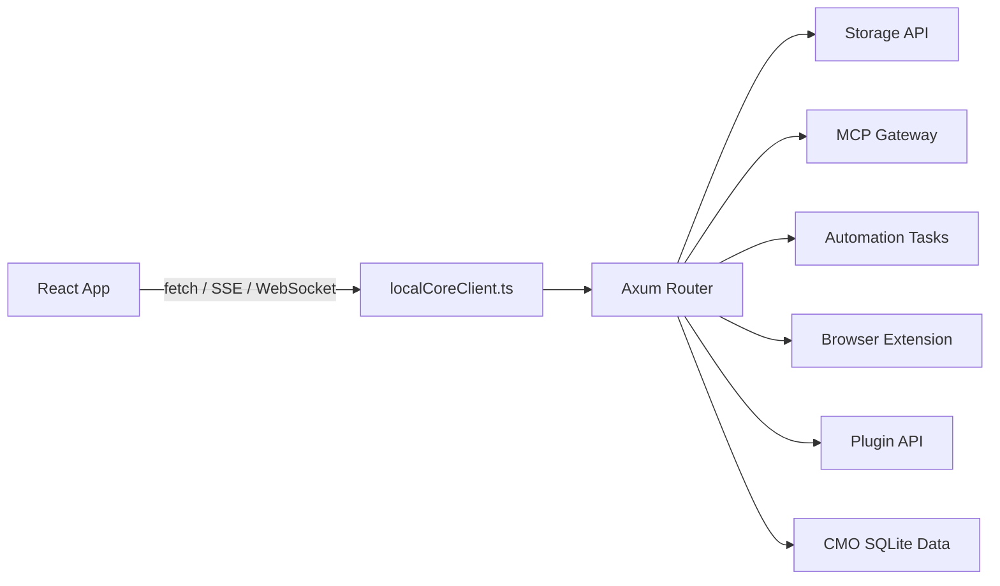

# Extending the Browser With a Local Runtime

Redbit is primarily a React + Vite application, but several workflows need capabilities that are awkward or unsafe to run directly in the browser: durable local operational data, large media handling, local tool execution, MCP transport normalization, browser extension coordination, and long-running automation status streams.

That boundary is handled by `local-core`, a Rust Axum daemon. The frontend accesses it through HTTP/SSE/WebSocket style endpoints, with the default base URL resolved by `src/services/localCoreClient.ts` as `http://127.0.0.1:19831`.

---

## Core Responsibilities

Inside `/local-core/src/`, the daemon owns the high-side-effect work that should not live inside React components or Zustand stores.

### 1. SQLite-backed CMO data

`local-core/src/database.rs` defines `CmoDatabase` on top of `rusqlite`. The CMO API exposed from `local-core/src/cmo_handlers.rs` stores and queries campaigns, leads, account profiles, metrics, automation runs, learning events, plugin execution events, and session assets.

The relevant routes are mounted in `local-core/src/handlers/mod.rs`, including:

- `/cmo/campaigns`
- `/cmo/leads`
- `/cmo/accounts`
- `/cmo/automation-runs`
- `/cmo/automation-learning-events`
- `/cmo/plugin-execution-events`
- `/cmo/stats`

This keeps CMO operational data local and structured, while the React app remains focused on UI orchestration.

### 2. Media parsing and FFmpeg operations

Local Core exposes media endpoints for workflows that need `yt-dlp`, direct media downloads, stream routing, and FFmpeg composition:

- `/media/yt-dlp/parse`
- `/media/yt-dlp/download`
- `/media/yt-dlp/stream`
- `/media/ffmpeg/concat`
- `/media/ffmpeg/overlay-audio`
- `/media/ffmpeg/burn-subtitles`

The Rust side handles process invocation, timeout/error policy, size checks, and SSRF guards. This avoids pushing heavyweight media parsing into the browser tab.

### 3. Storage, MCP, automation, and plugins

Local Core also centralizes several local integration surfaces:

<!-- mermaid-render: en-architecture-local-core-01.png -->

Mermaid 源图

- Storage bridge: `/storage/blob/{key}`, `/storage/usage`, `/storage/gc`.
- MCP gateway: `/mcp-gateway`, `/mcp-gateway/health`.
- Automation: `/automation/tasks`, `/automation/tasks/{id}/status-stream`, `/ws/automation`.
- Browser extension: `/extension/status`, `/extension/extract`, `/extension/open-installer`.
- Plugins: `/plugins`, `/plugins/install`, `/plugins/{name}/invoke`, `/plugins/{name}/health`.
- Proxy and scrape: `/proxy`, `/scrape/url`, with SSRF checks for internal URLs.

<Card title="Correct Mental Model" icon="shield" color="#FACC15">
  Local Core is not a Tauri JSON-RPC layer in the current codebase. It is a Rust Axum service consumed by the frontend through local HTTP, SSE, and WebSocket endpoints.
</Card>
