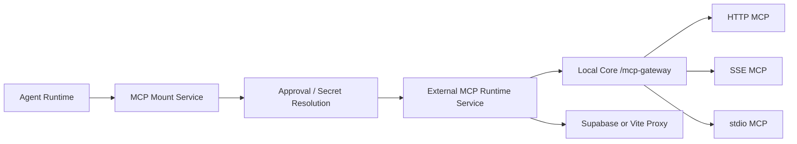

# What is MCP?

The Model Context Protocol (MCP) gives external systems a standard way to expose tools, resources, and prompts to an agent runtime. In Redbit, MCP is useful because the agent can discover and call external capabilities without hard-coding every integration inside React.

Redbit supports MCP through a gateway layer that normalizes several transports:

- streamable HTTP MCP servers;
- legacy SSE MCP servers;
- local stdio MCP servers through the local bridge;
- Local Core `/mcp-gateway` when the Rust daemon is available;
- Supabase/Vite proxy fallback paths when configured.

---

## Gateway Mental Model

The frontend does not call arbitrary MCP transports directly from every feature. Instead, the agent services and store layer resolve mounts, approvals, secrets, and transport details before the tool becomes available to the runtime.

<CardGroup cols={2}>
  <Card title="Transport Normalization" icon="arrows-rotate" color="#22C55E">
    `src/agents/services/externalMcpRuntimeService.ts`, `src/agents/services/mcpCompanionService.ts`, and `local-core/src/gateway.rs` normalize HTTP, SSE, and stdio MCP targets behind gateway-style requests.
  </Card>
  <Card title="Approval and Mutation Policy" icon="shield-halved" color="#EF4444">
    `src/store/useMcpStore.ts` records approval requests, while `src/agents/toolCallPipeline.ts` tracks mutation tools and can pause unsafe chains after side-effecting calls.
  </Card>
</CardGroup>

<!-- mermaid-render: en-developers-mcp-gateway-01.png -->


<details>
<summary>Mermaid 源图</summary>



</details>

## Developer Bootstrapping

As a third-party developer, you expose a focused MCP server and let Redbit mount it instead of changing Redbit's core React code.

```python
# Example private MCP server
from mcp.server import Server

app = Server("enterprise_tools")

@app.tool()
def lookup_customer_segment(customer_id: str) -> str:
    """Returns the marketing segment for a customer ID."""
    # ...authenticated business logic...
    return "enterprise_trial"

if __name__ == "__main__":
    app.run(transport="stdio")
```

After the server is configured as an MCP mount, Redbit can route eligible agent tool calls through the gateway. For stdio mounts, the gateway/bridge carries the command, arguments, and environment through explicit headers rather than pretending the browser owns a native process.

## What the Gateway Does Not Promise

The gateway is not a blanket CORS bypass, an enterprise VPN, or an unlimited authority layer. It is a controlled integration boundary. The useful promises are narrower and more important:

- one agent-facing access pattern across multiple MCP transports;
- explicit mount and approval state;
- secret handling through Redbit MCP services;
- safer mutation tracking in the tool pipeline;
- a local Rust path when Local Core is installed and paired.
