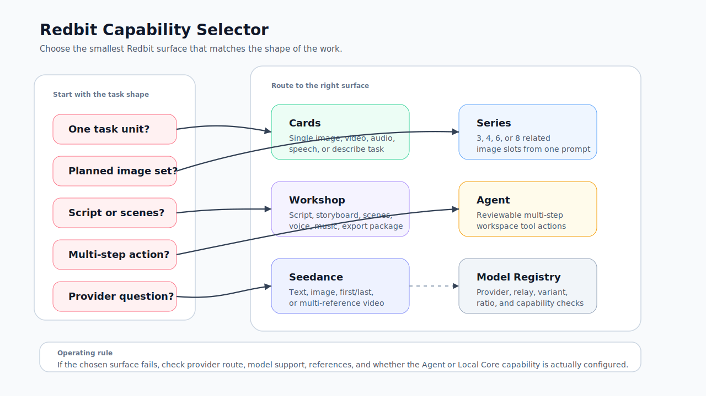

# Decision Matrix

Use this matrix when a user asks, "Which Redbit surface should I use for this job?" The answer should come from the shape of the work, not from whichever button is most visible.

## Who Should Read This

| Reader | Use this page to |
| --- | --- |
| New user | Choose the first Redbit module for a task |
| Creative operator | Decide when to move from one-off generation into Series or Workshop |
| Support or success team | Triage a confused workflow without overstating product capabilities |

## Before You Choose

Confirm the media type, provider route, reference inputs, and review owner. If the task involves sensitive media, read [Security and Credentials](./security-credentials.mdx) before uploading or routing source material.

## Capability Selector

The SVG below is a capability selector. Use it during onboarding or support calls to map user intent to the smallest Redbit surface that can complete the job.

## Matrix

| Surface | Use when | Avoid when | Typical output |
| --- | --- | --- | --- |
| Cards | The job is one independent image, video, audio, speech, or describe task | The work has many scenes, scripts, or export stages | Card results, downloads, reusable references |
| Series | One image prompt should become a planned set of 3, 4, 6, or 8 related images | Each image needs unrelated prompts or separate review rules | Slot briefs, editable prompts, reviewed image set |
| Workshop | The job has project structure: script, scenes, consistency references, media stages, voiceover, music, or export | The task is only one prompt and one output | Project state, scene media, voice/music assets, export package where configured |
| Agent | The request spans several explicit Redbit actions and can be checked in the workspace | The task is credential entry, billing, visual judgement, ambiguous deletion, or unreviewed external effect | Created or updated Cards, assets, Workshop changes, tool results |
| Seedance | The video task needs text-to-video, image-to-video, first/last-frame, or multi-reference roles | The selected provider route does not support the Seedance variant or required input roles | Video card result with mode-specific references |
| Model Registry and Settings | The question is model visibility, provider route, relay capability, variant, ratio, duration, or Agent runtime profile | The user only needs to compare generated media visually | Confirmed provider setup, model selection, capability test result |

## Quick Questions

| Ask | If yes |
| --- | --- |
| Does the work need only one inspectable task unit? | Start with Cards |
| Does one prompt need a repeatable image set? | Use Series |
| Does the work have script, scene, or export structure? | Use Workshop |
| Does the user want multiple explicit UI actions? | Use Agent after confirming targets |
| Does the video depend on first frame, last frame, or multiple references? | Use Seedance-specific workflow |
| Is the issue about a missing model or failed provider route? | Check Model Registry and Settings |

## Handoff Rules

| Situation | Minimum handoff artifact |
| --- | --- |
| Card-only exploration | Selected cards, prompt notes, model and variant, downloads or pinned assets |
| Series output | Base prompt, template, slot prompts, selected outputs, rejected outputs if useful |
| Workshop project | Project name, scenes, selected source images, generated clips, export settings |
| Agent-assisted task | Original request, tool actions, visible workspace changes, unresolved confirmations |
| Provider troubleshooting | Route, model family, variant, error message, relay setting, provider console status |

## Next Step

Use [First Project Walkthrough](./first-project-walkthrough.mdx) to apply the matrix in a real flow, or [Troubleshooting Playbook](./troubleshooting.mdx) when the chosen surface does not complete successfully.
