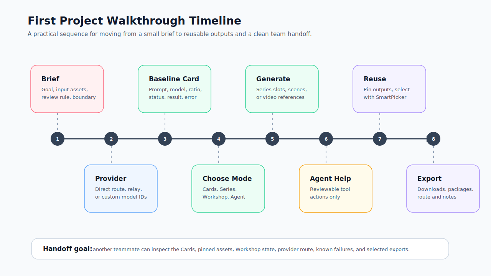

# First Project Walkthrough

This walkthrough uses one realistic project shape: a small product launch package with product images, short video options, and handoff artifacts. Adapt the same sequence for social posts, explainers, storyboard tests, or Agent-assisted research.

## Who Should Read This

| Reader | Use this page when |
| --- | --- |
| New user | You want a complete first run instead of isolated feature descriptions |
| Team lead | You need a demo path that shows setup, generation, reuse, and handoff |
| Operator | You are deciding when to stay in Cards, move to Workshop, or ask the Agent for help |

## Before You Start

Prepare one small brief, one or more approved source assets, and a provider account or relay that supports the media type you want to test. Keep credentials in Settings, not in prompts, Cards, Workshop scripts, or Agent chat.

## Walkthrough Timeline

The SVG below is a first-project timeline. Use it to explain the practical order of work during onboarding: brief, provider, card baseline, module choice, generation, reuse, export, and handoff.

## Project Brief

| Field | Example |
| --- | --- |
| Goal | Produce a compact product launch package for review |
| Inputs | Product photo, short positioning note, target ratio, optional brand style notes |
| Outputs | 4 to 6 candidate images, 1 to 2 short video options if provider route supports video, and reusable references |
| Review rule | Human reviewer selects final outputs before publishing |
| Boundary | Redbit coordinates the workspace; provider quota, policy, latency, and output quality remain provider-owned |

## End-to-End Steps

<Steps>
  <Step title="Create the input record">
    Start in `/dashboard`. Add the brief as prompt text on an Image Card or keep it as a text asset in Asset Dock. Upload only approved product references.
  </Step>
  <Step title="Configure the provider route">
    Open Settings and configure the minimum image provider or relay needed for the first pass. If the project includes video, also confirm the video model family and variant before sending source media.
  </Step>
  <Step title="Run one baseline Card">
    Create one Image Card, choose model, ratio, and references, then generate. Review the card status, result, error state, and download behavior before scaling the workflow.
  </Step>
  <Step title="Choose the working mode">
    Use Cards for isolated options, Series for planned image sets, Workshop for scripts and scenes, Agent for bounded multi-step workspace actions, Seedance for reference-role video tasks, and Model Registry/Settings when the question is provider capability.
  </Step>
  <Step title="Expand into Series or Workshop">
    For a product image set, switch the Image Card to Series and use `ecommerce`, `social`, or `brand`. For a multi-scene video, create a Workshop project and add script, scenes, references, and output settings.
  </Step>
  <Step title="Use Agent only for reviewable multi-step work">
    Ask the Agent to create cards, group candidates, open SmartPicker, or prepare a Workshop project when the target is explicit. Keep credentials, ambiguous deletion, billing, and real-account actions manual.
  </Step>
  <Step title="Reuse selected outputs">
    Pin useful results to Asset Dock. Use SmartPicker to feed selected images into later Cards, Workshop scenes, or Seedance first-frame and first/last-frame modes.
  </Step>
  <Step title="Export and hand off">
    Download card outputs or export Workshop artifacts where configured. Record the selected model route, source assets, known failures, and review decisions for the next teammate.
  </Step>
</Steps>

## Decision Points During the Walkthrough

| If this happens | Choose |
| --- | --- |
| One prompt needs one or two outputs | Manual Cards |
| One prompt should become a structured image set | Series mode on Image Cards |
| The work has scripts, scenes, voiceover, music, or export packages | Workshop |
| The user asks for several explicit workspace actions | Agent runtime |
| The video needs first frame, first and last frame, or multi-reference roles | Seedance workflow |
| A model is missing, failing, or filtered by relay | Model Registry and Settings checks |

## Acceptance Checklist

| Check | Done when |
| --- | --- |
| Provider route is understood | The team can name direct provider, relay, custom relay, or Local Core usage |
| Baseline generation ran | At least one Card has a visible result or actionable error |
| Reuse is proven | One output is pinned or selected as a reference |
| Project structure is clear | Cards, Series slots, or Workshop scenes are named well enough for handoff |
| Export path is tested | A download, Workshop export, or documented handoff artifact exists |
| Troubleshooting notes are captured | Any provider, model, Agent, i18n, or video issue has a recovery note |

## Next Step

Use [Security and Credentials](./security-credentials.mdx) before real customer material, and keep [Troubleshooting Playbook](./troubleshooting.mdx) open during the first provider-backed run.
