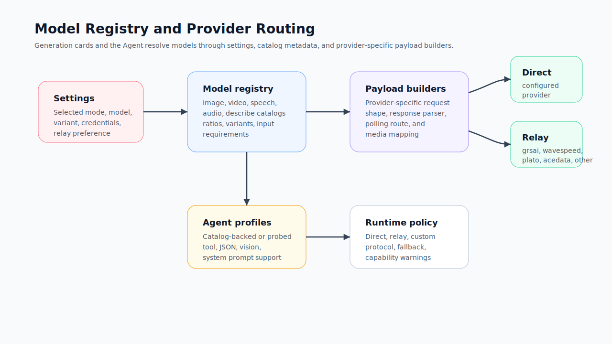

# Models and Provider Configuration

Redbit uses a model registry rather than scattering provider choices across individual components. Settings chooses the active model family and variant for each media type; the registry defines what that model supports; payload builders create provider-specific requests.

## Who Should Read This

Read this before configuring real provider access, debugging a missing model, or explaining where API keys, relay routes, Agent profiles, and Local Core boundaries sit.

## Before You Read

Redbit is BYOK by default. Settings can store credentials and route requests, but the provider account controls quota, billing, access region, safety policy, retention policy, and model uptime.

## Configuration Layers

| Layer | What it controls |
| --- | --- |
| Model family | `nano-banana`, `see-dream`, `flux`, `gpt-image`, `veo`, `seedance`, `minimax`, `suno`, and other catalog groups |
| Variant | Provider/model-specific concrete ID, such as `doubao-seedance-2.0-fast` |
| Provider credentials | API key or access-key/secret-key credentials depending on model family |
| Relay mode | Route compatible media requests through configured relay providers |
| Custom relay | Let users list relay-supported model IDs by media type |
| Agent runtime | Separate model mode for the assistant: `auto`, `relay`, or `custom`, with optional role-specific overrides |

## Current Catalog Snapshot

| Media type | Model groups in the current registry |
| --- | --- |
| Image | NanoBanana, SeeDream, Flux, GPT Image |
| Video | Veo, Wan 2.2 Animate, Jimeng Video, Seedance 2.0, Kling Motion |
| Speech / avatar | InfiniteTalk, Pixverse, Jimeng, Kling |
| Audio / music | Minimax, Suno |
| Describe / Agent LLM | Gemini 3/2.5/2.0 family, GPT-5.2, GPT-5.1, GPT-4o |

Exact availability in the UI can change when relay mode or custom relay model lists are enabled, because Settings filters visible models by provider capability.

Different models should not be expected to produce identical results from the same prompt. They may differ in prompt interpretation, reference strength, aspect-ratio support, safety filters, latency, output format, and whether they support image, video, audio, or structured inputs.

## Direct Provider vs Relay

| Route | Use when | Watch for |
| --- | --- | --- |
| Direct provider | You have credentials for the target provider and want the app to call the configured endpoint directly | Browser CORS, provider region, input format, quota, and provider policy |
| Relay provider | You use a compatible relay such as `grsai`, `wavespeed`, `plato`, `acedata`, or `other` | Relay model support can be narrower than the full catalog |
| Custom relay | You have an OpenAI-compatible or relay-like endpoint and know its supported media model IDs | You must list compatible model IDs by media type |
| Local Core | The workflow needs local media, storage bridge, FFmpeg, MCP, automation, plugin, or proxy functionality | Only pair a local engine you launched and trust |

## Credential Handling

Settings persists configuration in browser storage. Sensitive fields such as API keys, access keys, secret keys, and tokens are encrypted before persistence when available. If encryption or persistence fails, Redbit stores a redacted emergency snapshot rather than writing raw secrets.

Practical guidance:

- store credentials only in Settings;
- avoid pasting keys into cards, Workshop scripts, or Agent chat;
- use the smallest provider scope needed for the current workflow;
- rotate keys in the provider console if a key was exposed outside Settings;
- check provider terms before uploading confidential media.

## Agent Runtime Profiles

The Agent model is configured separately from generation models. Settings supports:

- `auto`: resolve a compatible assistant runtime from existing settings;
- `relay`: use a chat-capable relay route when available;
- `custom`: configure provider preset, protocol, base URL, API key, model ID, and optional role overrides.

Discovery reads available model IDs where the provider exposes a models endpoint. The capability test makes a real call and saves a local profile for tool calling, structured output, system prompt, and vision support. A failed required probe should not become the saved default profile.

## Next Step

Continue to [Security and Credentials](./security-credentials.mdx) before sending sensitive material through a provider route, or [Agent Workflows](./agent-workflows.mdx) to understand how the selected Agent runtime profile affects tool execution.
