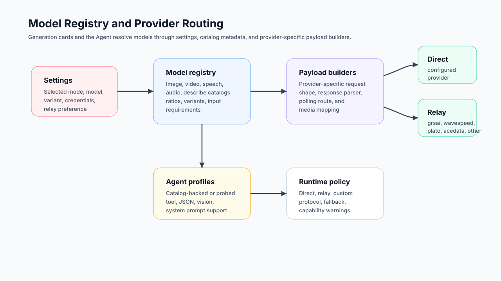

# Models and Provider Configuration

Redbit uses a model registry rather than scattering provider choices across individual components. Settings chooses the active model family and variant for each media type; the registry defines what that model supports; payload builders create provider-specific requests.

## Who Should Read This

Read this before configuring real provider access, debugging a missing model, or explaining where API keys, relay routes, Agent profiles, and Local Core boundaries sit.

## Before You Read

Redbit is BYOK by default. Settings can store credentials and route requests, but the provider account controls quota, billing, access region, safety policy, retention policy, and model uptime.

## Configuration Layers

| Layer | What it controls |
| --- | --- |
| Model family | `nano-banana`, `see-dream`, `flux`, `gpt-image`, `veo`, `seedance`, `minimax`, `suno`, and other catalog groups |
| Variant | Provider/model-specific concrete ID, such as `doubao-seedance-2.0-fast` |
| Provider credentials | API key or access-key/secret-key credentials depending on model family |
| Relay mode | Route compatible media requests through configured relay providers |
| Custom relay | Let users list relay-supported model IDs by media type |
| Agent runtime | Separate model mode for the assistant: `auto`, `relay`, or `custom`, with optional role-specific overrides |

## Current Catalog Snapshot

| Media type | Model groups in the current registry |
| --- | --- |
| Image | NanoBanana, SeeDream, Flux, GPT Image |
| Video | Veo, Wan 2.2 Animate, Jimeng Video, Seedance, Kling Motion, Kling Video |
| Speech / avatar | InfiniteTalk, Pixverse, Jimeng, Kling |
| Audio / music | Minimax, Suno |
| Describe / Agent LLM | Gemini 3.8/3.5/3.1/3/2.5 family, GPT-5.6/5.5/5.4/5.2/5.1, GPT-4o |

Exact availability in the UI can change when relay mode or custom relay model lists are enabled, because Settings filters visible models by provider capability.

### 2026-09 model refresh

The catalog is verified against each relay's own published catalog: AtlasCloud (`GET https://api.atlascloud.ai/api/v1/models`), WaveSpeed (`https://wavespeed.ai/api/models`), AceData (`docs.acedata.cloud/openapi/*.json` model enums) and Grsai (its API docs plus `grsai.ai/dashboard/models`). Run `pnpm audit:models` to re-check every slug; it also runs on model-registry pull requests and nightly. The current generation per family:

| Family | Shipped variants (newest first) |
| --- | --- |
| SeeDream | V5 Pro (`bytedance/seedream-v5.0-pro`), V5, V4.5, V4 |
| GPT Image | 2.5 Sunburst / 2.5 Flare, 2, 1.5, 1, 1 Mini |
| Seedance | 2.5, 2.0 Standard, 2.0 Fast, 2.0 Mini |
| Wan Video | 3.0 Prime, 3.0, 2.7, 2.6, 2.5 |
| Kling Motion | V3.0 Pro/Std Motion, V2.6 Pro/Std Motion |
| Midjourney (Youchuan) | V8.2, V8.1 |
| Minimax speech | 2.8 Turbo/HD, 2.6 Turbo/HD, 02 Turbo/HD |
| Suno | Chirp V6 |

Retired upstream and removed from the catalog: Suno `chirp-v3.5`/`v4`/`v4.5`/`v5` (promoted to `chirp-v6` on generation), Gemini `2.0-flash` (falls back to the default describe model) and `gemini-3-pro-preview` (migrated to `gemini-3.1-pro-preview`). WaveSpeed no longer serves `openai/gpt-image-1*`, so those variants are promoted to `openai/gpt-image-1.5` on that relay.

Different models should not be expected to produce identical results from the same prompt. They may differ in prompt interpretation, reference strength, aspect-ratio support, safety filters, latency, output format, and whether they support image, video, audio, or structured inputs.

## Direct Provider vs Relay

| Route | Use when | Watch for |
| --- | --- | --- |
| Direct provider | You have credentials for the target provider and want the app to call the configured endpoint directly | Browser CORS, provider region, input format, quota, and provider policy |
| Relay provider | You use a compatible relay such as `grsai`, `wavespeed`, `plato`, `acedata`, or `other` | Relay model support can be narrower than the full catalog |
| Custom relay | You have an OpenAI-compatible or relay-like endpoint and know its supported media model IDs | You must list compatible model IDs by media type |
| Local Core | The workflow needs local media, storage bridge, FFmpeg, MCP, automation, plugin, or proxy functionality | Only pair a local engine you launched and trust |

## Credential Handling

Settings persists configuration in browser storage. Once you save a credential it stays saved until you change, delete, or clear it: the full snapshot is written immediately, then upgraded to its encrypted form as soon as the local vault finishes (usually a few milliseconds). If encryption is unavailable — for example a non-secure `http://` origin without `crypto.subtle` — the credential is kept unencrypted rather than discarded, so it is never lost.

**Signing out clears local credentials too.** The account session ends and every credential this device stored on your behalf is removed: provider and relay API keys, access/secret keys, tokens, MCP secret references, and the local vault key itself. Base URLs, model choices and other non-secret preferences stay. This is what makes "sign out" safe on a shared machine — and it means you re-enter your keys the next time you sign in on that device. The button is labelled *Sign out & clear local credentials* for that reason. The credential-free snapshot is written before the vault key is destroyed, so no undecryptable leftover is left behind.

Keys are encrypted with a **non-exportable, device-bound key** kept in IndexedDB. They stay on this device and are never uploaded to Redbit. That protects against offline copies, browser-profile backups, and storage-scanning infostealers; it does not protect against scripts running on the page itself. Redbit keeps no server-side copy, so clearing browser data removes the stored keys with it.

Practical guidance:

- store credentials only in Settings;
- avoid pasting keys into cards, Workshop scripts, or Agent chat;
- use the smallest provider scope needed for the current workflow;
- rotate keys in the provider console if a key was exposed outside Settings;
- check provider terms before uploading confidential media.

## Agent Runtime Profiles

The Agent model is configured separately from generation models. Settings supports:

- `auto`: resolve a compatible assistant runtime from existing settings;
- `relay`: use a chat-capable relay route when available;
- `custom`: configure provider preset, protocol, base URL, API key, model ID, and optional role overrides.

Discovery reads available model IDs where the provider exposes a models endpoint. The capability test makes a real call and saves a local profile for tool calling, structured output, system prompt, and vision support. A failed required probe should not become the saved default profile.

## Next Step

Continue to [Security and Credentials](./security-credentials.mdx) before sending sensitive material through a provider route, or [Agent Workflows](./agent-workflows.mdx) to understand how the selected Agent runtime profile affects tool execution.
