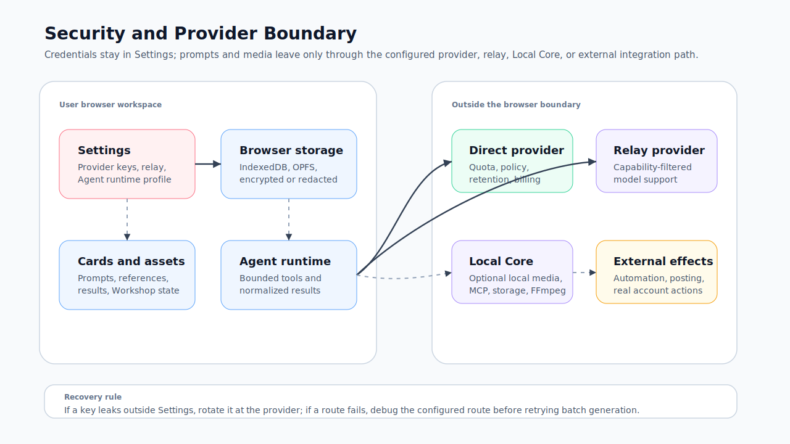

# Security and Credentials

Redbit is a BYOK workspace. It stores configuration locally, then routes each generation, Agent, or integration task through the provider, relay, or local service the user configured. This page defines that boundary so teams can evaluate Redbit without assuming hidden security promises.

## Who Should Read This

| Reader | Use this page to |
| --- | --- |
| Workspace owner | Decide where provider keys, relay settings, and local integrations belong |
| Security reviewer | Separate browser-local behavior from external provider behavior |
| Support operator | Recover from credential, route, quota, or provider failures without exposing secrets |

## Before You Configure

Do not paste API keys, access keys, secret keys, tokens, or cookies into prompts, Cards, Workshop scripts, Agent chat, screenshots, tickets, or documents. Use Settings fields and provider consoles. If a key was exposed outside Settings, rotate it in the provider console.

## Boundary Diagram

The SVG below shows the security and provider boundary. Use it to explain which parts are browser-local, which routes can call external providers, and where optional Local Core or external automation begins.

## What Lives Where

| Area | Owner | What it may contain | Boundary |
| --- | --- | --- | --- |
| Settings | User browser workspace | Provider keys, relay configuration, model defaults, Agent runtime profile | Store credentials here, not in prompts or chat |
| Browser storage | User browser profile | Cards, Asset Dock metadata, media blobs, settings snapshots, Workshop projects | Browser profile deletion, site data clearing, or quota pressure can remove data |
| Direct provider | User's provider account | Model requests, uploaded references, prompts, generated outputs | Quota, billing, retention, region, safety policy, and uptime are provider-owned |
| Relay provider | User-selected relay account or endpoint | Routed media or assistant requests | Relay support may be narrower than Redbit's full model registry |
| Local Core | User-started local service | Selected media, storage bridge, MCP, FFmpeg, automation, plugin, or local data operations | Pair only a local engine you launched and trust |
| External automation | User-approved integrations | Browser actions, posting, messaging, account workflows, MCP resources | Review real-account effects before execution |

## Credential Handling

Sensitive Settings fields such as API keys, access keys, secret keys, and tokens are encrypted before browser IndexedDB persistence when the browser crypto path is available. If encryption or persistence fails, Redbit stores a redacted emergency snapshot rather than raw secrets.

This is a local storage protection measure, not a guarantee about external provider retention. Once a workflow sends prompts or media to a provider, relay, Local Core endpoint, MCP mount, or automation target, that route's terms and configuration apply.

## Safe Configuration Rules

| Rule | Why it matters |
| --- | --- |
| Configure the smallest provider scope needed for the current workflow | Reduces accidental exposure and simplifies debugging |
| Verify direct provider vs relay before sending sensitive media | Different routes can have different policies and model support |
| Use placeholders in docs and tickets, such as `<provider-api-key>` | Prevents real secrets from entering version control or support systems |
| Do not commit `.env`, exported settings with raw keys, screenshots, or logs that expose secrets | The repository is not a credential store |
| Test Agent runtime capability before using tool-heavy tasks | Tool calling, structured output, system prompt, and vision support vary by model |
| Pair Local Core only when the workflow needs it | Browser-only generation does not need a local daemon |

## Failure and Recovery

| Symptom | Likely cause | Recovery |
| --- | --- | --- |
| Provider returns unauthorized | Wrong key type, expired key, missing scope, or wrong endpoint | Re-enter the key in Settings, confirm provider account status, and rotate if exposed |
| Model is missing after relay is enabled | Relay capability filter excludes that family or variant | Choose a supported relay model, switch to direct provider, or configure custom relay IDs only when verified |
| Browser storage warning or missing assets | Site data cleared, quota pressure, profile change, or failed persistence | Re-import assets, pin important outputs, export Workshop packages, and avoid relying on unpinned recent assets |
| Agent cannot use tools | Runtime profile lacks tool calling, structured output, or saved capability probe | Run capability test, choose another Agent runtime route, or keep the workflow manual |
| Local Core pairing fails | Local engine not running, wrong pairing code, blocked local port, or untrusted binary | Restart the local engine you launched, verify the port and pairing code, and do not pair unknown services |

## What Redbit Does Not Promise

| Not a Redbit promise | Practical interpretation |
| --- | --- |
| Provider quota or credits | Provider or relay account controls usage, billing, and limits |
| Identical output across models | Models differ in prompt parsing, references, safety filters, and post-processing |
| Provider privacy or retention terms | Check the selected provider or relay policy before uploading confidential media |
| Unlimited local persistence | Browser storage can be cleared or evicted; export important work |
| Unrestricted Agent autonomy | Agent actions are bounded by registered tools and should be reviewed for external effects |

## Next Step

Use [Models and Provider Configuration](./model-providers.mdx) for route setup details, then keep [Troubleshooting Playbook](./troubleshooting.mdx) available for provider and credential failures.
