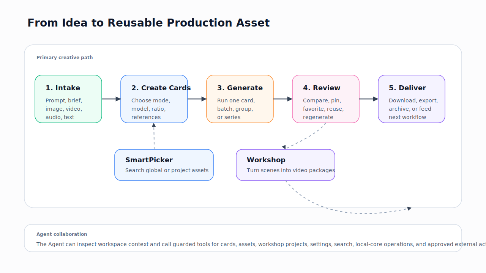

# Core Workflows

Redbit workflows usually start with an idea, a source asset, or a brief. The workspace then keeps every step inspectable: cards for individual tasks, Asset Dock for reusable materials, Workshop for project structure, and Agent tools for bounded automation.

## Who Should Read This

Read this page after [Quickstart](../quickstart.mdx) when you need to explain how work moves through Redbit, not just how to click the first button.

## Before You Read

Understand [Cards, References, Series, Workshop, Agent runtime, and Provider](./concepts.mdx). Also confirm whether the workflow will use a direct provider, relay, or Local Core path before sending sensitive source material.

## Roles

| Role | What they usually do in Redbit |
| --- | --- |
| Solo creator | Generate images, short videos, audio, and prompt variants while keeping reusable references visible |
| Creative operator | Build repeatable product, ad, character, or storyboard sets with series image templates and Workshop scenes |
| Growth or CMO operator | Combine creative assets, external research, local automation, and reviewable Agent actions |
| Technical operator | Configure providers, relays, Local Core, MCP mounts, and Agent model capability profiles |

## From Prompt to Card

<Steps>
  <Step title="Choose the mode">
    Pick `Image`, `Video`, `Speech`, `Audio`, or `Describe`. The selected mode determines visible models, defaults, ratios, and input requirements.
  </Step>
  <Step title="Prepare the prompt and references">
    Enter the prompt directly, attach source media, or use a previous result through Asset Dock or SmartPicker.
  </Step>
  <Step title="Generate and review">
    Run one card, selected cards, a group, or a series. Review status, result media, errors, favorites, and downloads on the card.
  </Step>
  <Step title="Reuse the result">
    Save the output to Asset Dock, use it as a later reference, compare it with another asset, or move the idea into Workshop.
  </Step>
</Steps>

## From Asset to New Creative Direction

Asset reuse is a first-class workflow. An uploaded image, a generated result, or a text prompt asset can become:

- a reference image for image generation;
- a first frame, last frame, or reference asset for Seedance video;
- a scene image inside Workshop;
- a prompt source for an Agent-assisted rewrite;
- an item to compare, pin, or keep as part of a project.

SmartPicker opens in global mode for Asset Dock items and project mode when a Workshop project context is available. It supports type filtering, search, previews, and single or multiple selection.

## From Script to Video Package

Workshop is the project path for multi-scene creative production:

1. Create a project from a built-in template or blank project.
2. Draft or optimize the script.
3. Create storyboard scenes with prompts, voiceover text, duration, and consistency references.
4. Generate scene images and choose selected source images.
5. Generate video clips, voiceover, music, and rhythm videos as needed.
6. Export project assets and timeline metadata through the export dialog.

Workshop currently supports built-in templates for a 15-second product ad, a 30-second product review, and a blank project. Export supports FCPXML and EDL-related types in the codebase, with full package or project-only modes.

## Agent-Assisted Workflow

The Agent is useful when a request spans more than one UI action:

- create, update, copy, delete, select, group, and generate cards;
- search or inspect cards/assets;
- open SmartPicker;
- switch tabs or modules;
- manage Workshop projects, scenes, settings, consistency items, media generation, import/export;
- run supported search, media, MCP, Local Core, CMO, or growth-report tools when configured.

The Agent is not an unrestricted shell. Registered tool metadata marks read, write, destructive, navigation, workflow, and external-effect tools. Destructive project/card actions require explicit targets or confirmation rules, and tool results are normalized before the loop continues.

## Next Step

Use [Feature Modules](./modules.mdx) for a module-by-module reference, then [Models and Provider Configuration](./model-providers.mdx) before configuring real provider access.
