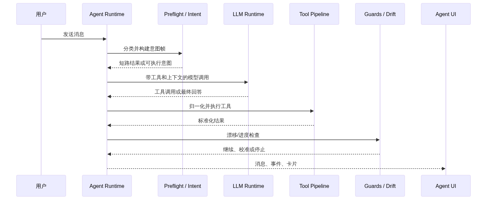
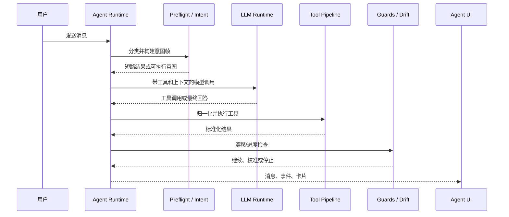
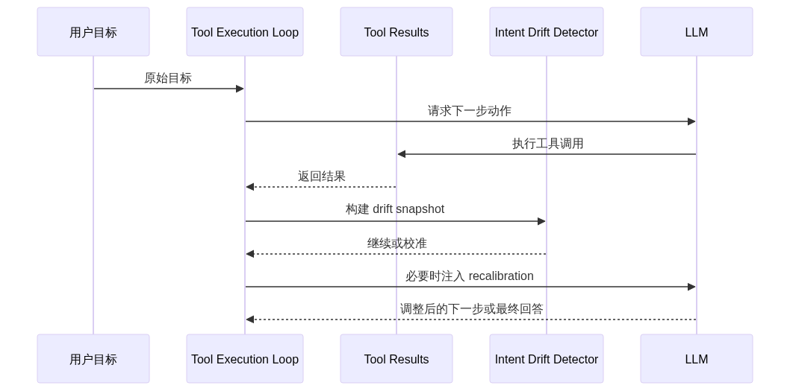
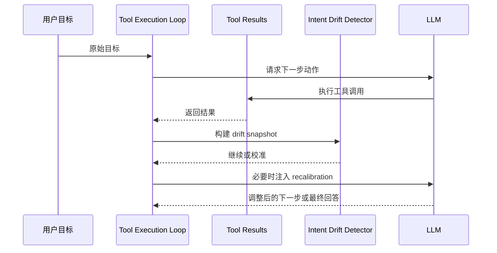

# Agent Harness：有边界的工具执行引擎

Redbit 的 `Agent Runtime` (`src/agents/`) 不只是一个聊天循环。它在模型调用外层包了一套 preflight 路由、模型能力解析、工具定义组装、执行防护、结果归一化和漂移检测，让 UI 能把 Agent 行为当作可观察的产品工作流，而不是不可解释的模型输出。

## Agent 模型运行时画像

主 Agent 不再假设所有 describe 模型都具备同一组能力。运行时选择集中在 `src/agents/modelResolver.ts` 和 `src/agents/agentModelRuntime.ts`：

- 内置 Gemini 与 OpenAI describe 模型使用 catalog 中声明的能力元数据；
- Settings 中的独立自定义 describe endpoint 可以按 `gemini`、`openai-compatible` 或 `anthropic` 协议进行能力探测；
- Settings 提供 provider-first 引导层，覆盖 OpenAI、Anthropic、Gemini、DeepSeek、OpenRouter、Groq、SiliconFlow 与自定义 OpenAI-compatible endpoint，可先自动填写协议、基础地址和推荐起步模型，再保留高级字段供用户手动编辑；
- 可用时，模型发现会调用服务商 `/models` 类端点，并将返回的模型 ID 作为快速选择项；不支持发现的中转或服务商仍可手动输入模型 ID 兜底；
- 探测成功后，能力画像只保存在本地，并按模型、协议、relay/direct 运行时和 endpoint 指纹隔离；
- required 探测步骤失败时不会保存画像，避免不可用的自定义模型静默成为 Agent 默认模型；
- 图片注入会读取最终解析出的 runtime/profile 能力，而不是只按模型名猜测，因此不支持 vision 的自定义 endpoint 不会收到图片 payload。

这使 Agent 可以使用 Gemini、GPT 系列等 catalog 模型，也可以通过 Anthropic 原生 Messages API 使用 Claude，并在探测证明 chat/system/tool/JSON 行为可用后接入 OpenAI-compatible provider。

## 意图路由与 Preflight

`src/agents/preFlightRouter.ts`、`src/agents/unifiedIntentRouter.ts` 和 `src/agents/intent/**` 构成完整工具执行前的第一层判断。

<Steps>
  <Step title="确定性短路">
    简单命令、已知 UI 动作和显式宏可以在完整模型轮次前直接处理。
  </Step>
  <Step title="意图帧构建">
    runtime 会生成标准化 intent frame，让下游工具接收稳定任务语义，而不是直接吃原始聊天文本。
  </Step>
  <Step title="模型运行时解析">
    `modelResolver.ts` 根据已配置 Agent 模型及其探测能力选择 provider、protocol 和 runtime profile。
  </Step>
  <Step title="必要时澄清">
    当请求过于模糊、直接执行风险较高时，Agent 可以要求补充约束，而不是自行猜测。
  </Step>
</Steps>

## Tool Loop 与 Pipeline

主执行路径经过 `src/agents/agentService.ts`、`src/agents/toolExecutionLoop.ts` 和 `src/agents/toolCallPipeline.ts`。

<!-- mermaid-render: zh-architecture-agent-runtime-01.png -->

Mermaid 源图

Pipeline 负责：

- atomic workflow 检查；
- execution-order 检查；
- MCP auto-mount 解析；
- tool call 归一化；
- retry 与 result normalization；
- mutation tracking；
- feature flag 开启时的 DAG planning。

## Feature-Flagged DAG 调度

Redbit 在 `src/agents/graph/graphOrchestrator.ts` 中已有 DAG planning primitives，`toolCallPipeline.ts` 在 `dag_scheduler_enabled` 开启时可以使用它们。更准确的说法是：这是增量执行优化，而不是所有请求的默认运行模型。

关闭时，runtime 仍走受控 tool loop；开启后，符合条件的独立工具调用可以按依赖关系分组执行。

<Info>
  面试时可以这样答：Redbit 已经具备图式执行基础、checkpoint 和 RMAC/workflow 集成，但稳定默认路径仍是受控 tool loop。
</Info>

## 漂移检测与校准

多轮执行中，`src/agents/intentDriftDetector.ts` 会构建 drift snapshot，`toolExecutionLoop.ts` 在发现 Agent 持续无进展或偏离原任务时，可以注入 recalibration message。

<!-- mermaid-render: zh-architecture-agent-runtime-02.png -->

Mermaid 源图

这并不意味着模型永远不会犯错。它提供的是一个可控工程面：观察工具进展、限制重复漂移、重新锚定模型，并向用户暴露更清晰的失败路径。
