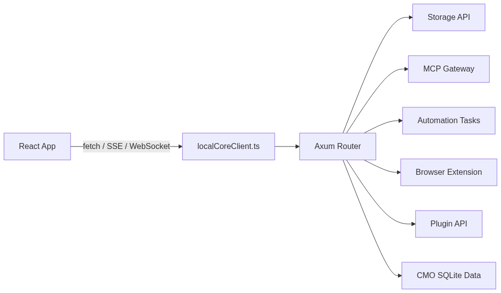
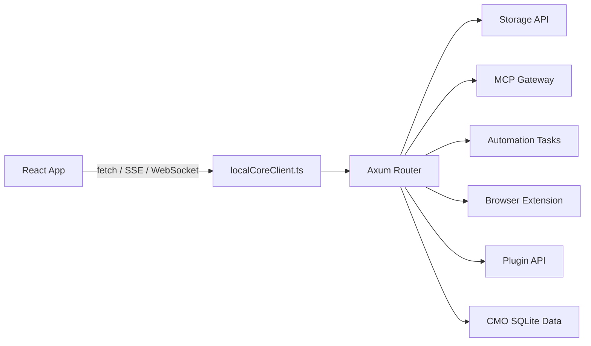

# 用本地运行时扩展浏览器边界

Redbit 的主体是 React + Vite 应用，但有些工作不适合直接放在浏览器里完成：持久化的本地运营数据、大体积媒体处理、本地工具执行、MCP transport 归一化、浏览器扩展协作，以及长任务状态流。

这些能力由 `local-core` 承担。它是一个 Rust Axum 本地守护进程，前端通过 HTTP/SSE/WebSocket 风格接口访问；默认地址由 `src/services/localCoreClient.ts` 解析为 `http://127.0.0.1:19831`。

---

## 核心职责

`/local-core/src/` 负责接管副作用重、生命周期长、或需要本地系统能力的工作，React 组件和 Zustand store 只做状态编排与 UI 反馈。

### 1. 基于 SQLite 的 CMO 数据

`local-core/src/database.rs` 基于 `rusqlite` 定义 `CmoDatabase`。`local-core/src/cmo_handlers.rs` 暴露 CMO API，用来存储和查询 campaigns、leads、account profiles、metrics、automation runs、learning events、plugin execution events、session assets 等运营数据。

相关路由在 `local-core/src/handlers/mod.rs` 中挂载，包括：

- `/cmo/campaigns`
- `/cmo/leads`
- `/cmo/accounts`
- `/cmo/automation-runs`
- `/cmo/automation-learning-events`
- `/cmo/plugin-execution-events`
- `/cmo/stats`

这让 CMO 运营数据保持本地、结构化，同时前端仍专注于交互和状态编排。

### 2. 媒体解析与 FFmpeg 操作

Local Core 暴露媒体端点，用于 `yt-dlp`、直接媒体下载、流式读取和 FFmpeg 合成：

- `/media/yt-dlp/parse`
- `/media/yt-dlp/download`
- `/media/yt-dlp/stream`
- `/media/ffmpeg/concat`
- `/media/ffmpeg/overlay-audio`
- `/media/ffmpeg/burn-subtitles`

Rust 侧负责进程调用、超时/错误策略、文件大小检查和 SSRF 防护，避免把重型媒体解析压到浏览器标签页里。

### 3. 存储、MCP、自动化与插件

Local Core 还统一承载多类本地集成面：

<!-- mermaid-render: zh-architecture-local-core-01.png -->

Mermaid 源图

- Storage bridge：`/storage/blob/{key}`、`/storage/usage`、`/storage/gc`。
- MCP gateway：`/mcp-gateway`、`/mcp-gateway/health`。
- Automation：`/automation/tasks`、`/automation/tasks/{id}/status-stream`、`/ws/automation`。
- Browser extension：`/extension/status`、`/extension/extract`、`/extension/open-installer`。
- Plugins：`/plugins`、`/plugins/install`、`/plugins/{name}/invoke`、`/plugins/{name}/health`。
- Proxy 与 scrape：`/proxy`、`/scrape/url`，并通过 SSRF 检查阻断内部地址。

<Card title="正确心智模型" icon="shield" color="#FACC15">
  当前代码中的 Local Core 不是 Tauri JSON-RPC 层，而是一个由前端通过本地 HTTP、SSE、WebSocket 访问的 Rust Axum 服务。
</Card>
