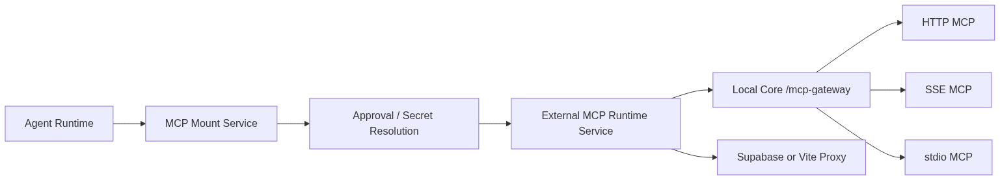
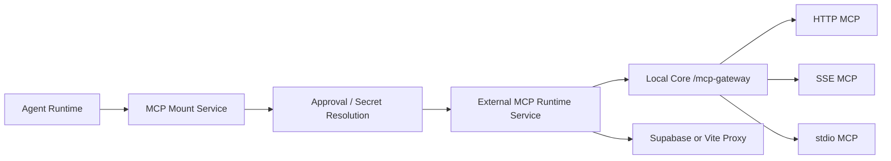

# 什么是 MCP？

Model Context Protocol (MCP) 让外部系统可以用标准方式向 Agent Runtime 暴露 tools、resources 和 prompts。对 Redbit 来说，MCP 的价值是：Agent 能发现并调用外部能力，而不需要把每个集成都硬编码进 React。

Redbit 的 MCP gateway 层负责归一化多种 transport：

- streamable HTTP MCP server；
- legacy SSE MCP server；
- 通过本地 bridge 接入的 stdio MCP server；
- Local Core 可用时的 `/mcp-gateway`；
- 按配置使用的 Supabase/Vite proxy fallback。

---

## Gateway 心智模型

前端不是在每个功能里直接访问任意 MCP transport。Agent service 与 store 层会先解析 mount、approval、secret 和 transport，确认工具可用后再交给 runtime。

<CardGroup cols={2}>
  <Card title="Transport 归一化" icon="arrows-rotate" color="#22C55E">
    `src/agents/services/externalMcpRuntimeService.ts`、`src/agents/services/mcpCompanionService.ts` 和 `local-core/src/gateway.rs` 将 HTTP、SSE、stdio MCP 目标归一到 gateway-style 请求后面。
  </Card>
  <Card title="审批与 Mutation 策略" icon="shield-halved" color="#EF4444">
    `src/store/useMcpStore.ts` 记录 approval requests，`src/agents/toolCallPipeline.ts` 负责识别 mutation tools，并可在有副作用调用后暂停不安全链路。
  </Card>
</CardGroup>

<!-- mermaid-render: zh-developers-mcp-gateway-01.png -->


<details>
<summary>Mermaid 源图</summary>



</details>

## 开发者快速接入

第三方开发者只需要暴露一个聚焦的 MCP server，并让 Redbit 挂载它，不需要改 Redbit 的核心 React 代码。

```python
# 私有 MCP server 示例
from mcp.server import Server

app = Server("enterprise_tools")

@app.tool()
def lookup_customer_segment(customer_id: str) -> str:
    """查询客户所属营销分层。"""
    # ...已鉴权的业务逻辑...
    return "enterprise_trial"

if __name__ == "__main__":
    app.run(transport="stdio")
```

当这个 server 被配置成 MCP mount 后，Redbit 可以把符合条件的 Agent tool call 路由到 gateway。对于 stdio mount，gateway/bridge 会通过显式 header 传递 command、args 和 env，而不是假设浏览器可以直接持有本地进程。

## Gateway 不承诺什么

Gateway 不是通用 CORS 绕过器、企业 VPN 或无限权限层。它是一个受控集成边界。更准确也更重要的价值是：

- 面向 Agent 的统一访问模式，背后可以是不同 MCP transport；
- 显式 mount 与 approval 状态；
- 通过 Redbit MCP services 处理 secret；
- 在 tool pipeline 中进行 mutation tracking；
- Local Core 安装并配对后可走本地 Rust gateway 路径。
