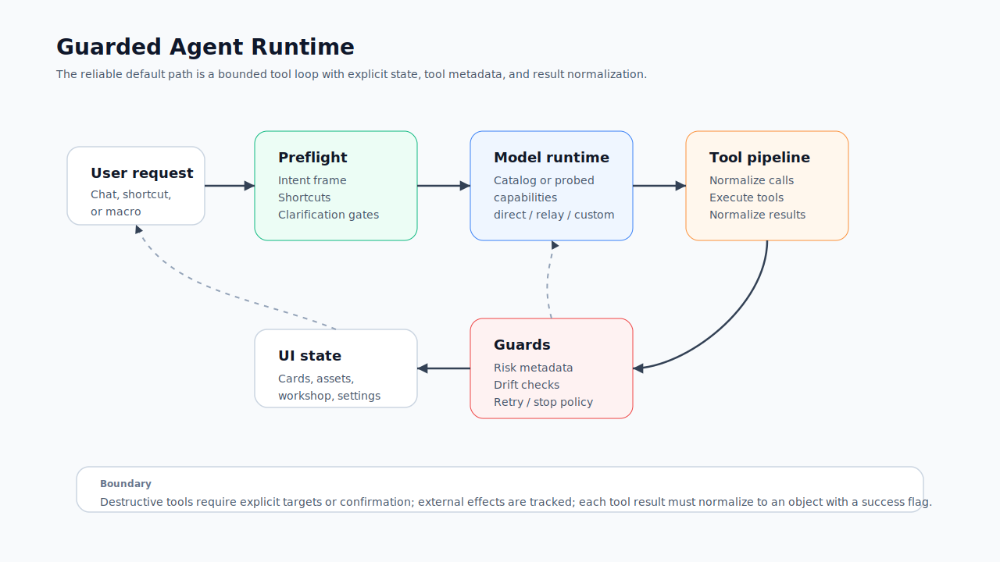

# Agent 工作模式

Redbit Agent 是工作区操作员，不是无限制自主进程。它读取结构化应用上下文，从已注册工具中选择动作，经受控 pipeline 执行，并把归一化结果返回 UI。

## 谁应该阅读本文

如果你准备让 Agent 创建 Cards、操作 Workshop、搜索素材、使用 MCP/Local Core 集成，或需要向用户解释 Agent 安全边界，请读这一页。

## 前置概念

Agent 使用单独配置的助手模型 runtime。它的行为取决于所选模型是否支持 tool calling、structured output、system prompt、vision 和中继。依赖它执行多步任务前，请先测试 Agent runtime profile。

## Agent 可以处理什么

| 区域 | 支持动作示例 |
| --- | --- |
| 卡片 | 创建、更新、复制、删除、选择、分组、生成、设置参考、下载、收藏、取消、重试 |
| 素材 | 搜索、检查、预览、导入、管理、打开 SmartPicker |
| 生成器 | 切换标签、切换模型、设置比例、清空参考 |
| 工作坊 | 创建/打开/重命名/复制/删除项目，管理场景，优化脚本，生成图片/视频/旁白/音乐/节奏，导出/导入归档 |
| Settings | 通过已注册工具打开设置、更新模型/供应商相关设置 |
| 搜索与外部来源 | 配置可用时使用 Web/search 工具、媒体 URL 解析/下载、Civitai prompt、RSS/Hacker News/Reddit/signal 工具 |
| 本地集成 | 可用时使用 MCP 资源、Local Core 媒体/自动化/插件路径、FFmpeg helper、CMO 和增长报告工具 |

## 安全运行模型

Agent runtime 有多层边界：

- preflight 路由可以在完整模型循环前处理简单 UI 命令；
- intent frame 把用户请求归一为稳定动作；
- 模型运行时解析会检查目录元数据或已保存能力 profile；
- 工具带有 capability、risk、side-effect、idempotency、confirmation 和 parallel-safety 元数据；
- 删除卡片、删除项目、删除场景和清理工作区等破坏性工具会区别于只读工具；
- 工具结果会归一化为带成功/错误信号的对象，再影响下一轮模型调用；
- 长任务中如果偏离原始目标，漂移检查可以重新锚定模型。

## 常见 Agent 任务

<AccordionGroup>
  <Accordion title="从一个 prompt 创建图像变体" icon="copy">
    可以让 Agent 创建多张图像卡片、优化 prompt、生成并分组结果。内置 `model_arena` 工作流是当前最清晰的例子。
  </Accordion>
  <Accordion title="把图片推进到视频卡片" icon="film">
    Agent 可以先创建并生成图像卡片，再创建视频卡片，将图片设为参考并生成视频。实际模型支持仍取决于所选供应商和输入要求。
  </Accordion>
  <Accordion title="管理工作坊项目" icon="clapperboard">
    Agent 可以创建或打开项目，更新脚本和场景，生成场景素材，管理一致性参考，并调用导出工具。删除项目或场景必须有明确目标。
  </Accordion>
  <Accordion title="打开 SmartPicker 选择素材" icon="folder-search">
    Agent 可以带着素材类型和初始搜索词打开 picker，让用户自己选择准确媒体，而不是让模型猜测。
  </Accordion>
</AccordionGroup>

## 什么时候应该手动操作

以下情况更适合使用手动控件：

- 涉及凭证或供应商计费设置；
- 需要对具体画面、帧或设计细节做视觉判断；
- 破坏性操作目标不明确；
- 外部发布、私信或自动化会影响真实账号；
- 供应商路由或模型能力尚未验证。

当任务包含多个明确 UI 步骤，且结果能在工作区里检查时，适合用 Agent。当任务已经变成带脚本、场景、一致性参考和导出的结构化创意项目时，适合用 Workshop。当核心工作是视觉判断或凭证管理时，请使用手动控件。

## Tool Result Contract

每个工具都应返回可以归一化为 `{ success: boolean; ... }` 的对象。只有友好文案但没有成功信号，不足以让 runtime 信任该动作。相关约定见 [`docs/contracts/tool-result-contract.md`](../../contracts/tool-result-contract.md)。

## 下一步

如果 Agent 任务会创建视频参考，继续看 [Seedance 视频工作流](./seedance-video.mdx)；在让 Agent 使用已配置供应商或外部集成前，先过 [操作检查清单](./checklists.mdx)。
