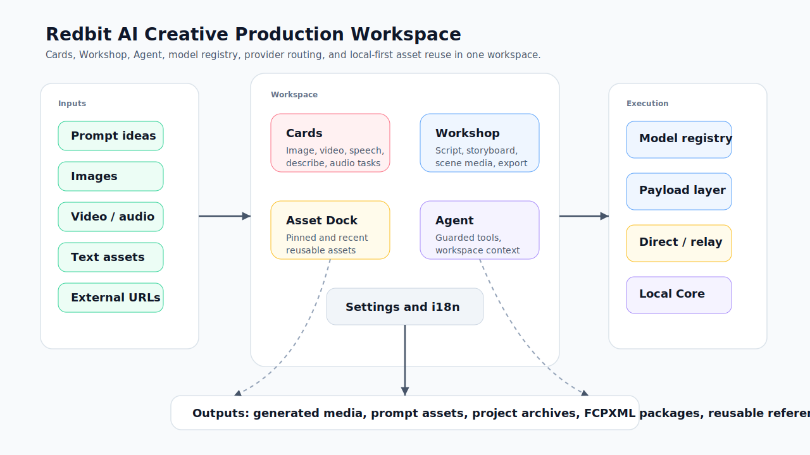
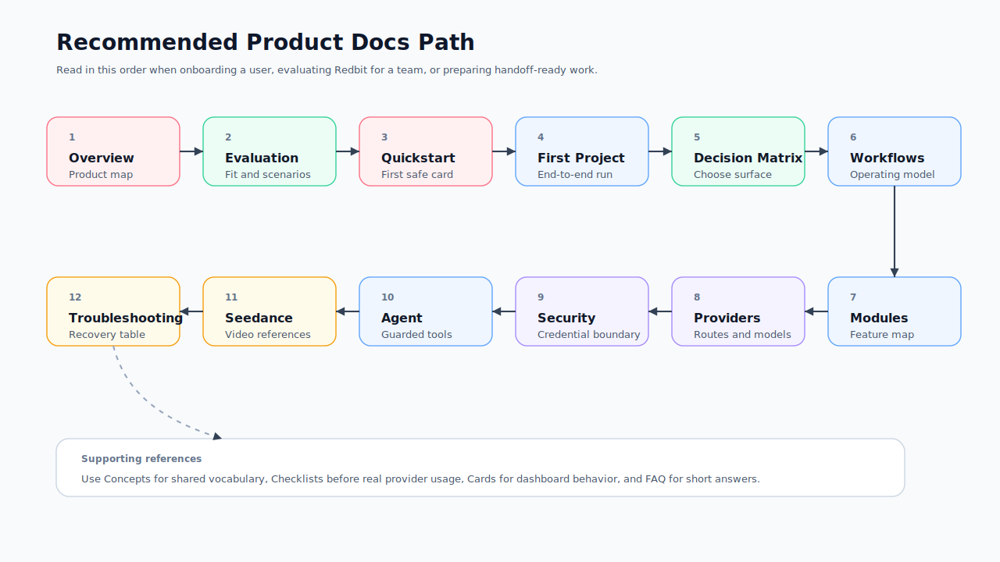

# Studio 工作台概览

Redbit AI 是一个创意生产工作台，用来把 prompt、源素材和可复用资产组织成图像、视频、语音、音频和项目输出。核心工作区由独立任务卡片、素材码头、Creative Workshop、受控 Agent 层和显式模型/供应商配置组成。

## 谁应该阅读本文

| 读者 | 适合用本文解决什么问题 |
| --- | --- |
| 新用户 | 在第一次生成前理解主要工作区 |
| 客户沟通团队 | 说明 Redbit 负责协调什么、哪些仍由供应商决定 |
| 团队成员 | 在编辑更深层文档前统一产品、支持和研发语言 |

## 前置概念

如果术语还不熟，先快速读 [核心概念与术语表](./concepts.mdx)。Redbit 围绕已配置供应商组织工作流；它不保证供应商额度、耗时、在线状态、政策或输出质量。

## 推荐阅读路径

面向用户、客户或团队成员做产品 onboarding 时，建议按这个顺序阅读：

1. [Studio 工作台概览](./overview.mdx)
2. [评估指南](./evaluation-guide.mdx)
3. [快速开始](../quickstart.mdx)
4. [第一个项目演练](./first-project-walkthrough.mdx)
5. [选择矩阵](./decision-matrix.mdx)
6. [核心工作流](./workflows.mdx)
7. [功能模块](./modules.mdx)
8. [模型与供应商配置](./model-providers.mdx)
9. [安全与凭据](./security-credentials.mdx)
10. [Agent 工作模式](./agent-workflows.mdx)
11. [Seedance 视频工作流](./seedance-video.mdx)
12. [排障手册](./troubleshooting.mdx)

## 产品定位

Redbit 不只是聊天界面，也不只是模型 API 外壳。它更像一层工作流界面，把创意生产过程变得可见、可复用、可检查：

- prompt 和生成结果保存在卡片里，而不是埋在线性聊天记录中；
- 素材可以在卡片、素材码头、SmartPicker 和工作坊项目之间流动；
- 模型路由通过 Settings 与模型注册表配置，而不是散落在每个按钮里；
- Agent 可以读取工作区状态，并调用受边界约束的工具来操作卡片、素材、工作坊、设置、搜索和本地集成。

## 主要区域

<Steps>
  <Step title="画布">
    `/dashboard` 工作区展示 `image`、`video`、`speech`、`describe` 和 `audio` 任务卡片。每张卡片保存自己的 prompt、模型、变体、比例、参考素材、生成状态和结果。
  </Step>

  <Step title="素材码头">
    素材码头保存图片、视频、音频和文本资产。素材可以置顶、搜索、对比，并通过 SmartPicker 作为后续任务的参考。
  </Step>

  <Step title="Creative Workshop">
    `/workshop` 管理项目级创意生产：脚本、分镜场景、图像生成、视频生成、旁白、音乐、节奏视频、一致性参考和导出包。
  </Step>

  <Step title="设置与模型注册表">
    Settings 管理默认模型、供应商凭证、中继配置、自定义模型端点、Agent 运行模式和能力测试。模型目录定义支持的模型家族、变体、比例和输入要求。
  </Step>

  <Step title="Agent 面板">
    Agent 读取结构化工作区快照并调用已注册工具。破坏性操作和外部副作用会受到工具元数据、结果归一化和明确目标检查的约束。
  </Step>
</Steps>

## 模块摘要

| 模块 | 当前职责 | 产品价值 |
| --- | --- | --- |
| Cards | 独立生成与评审单元 | 对比、复制、分组、批量生成、设置参考，并按任务保留结果 |
| 系列图模板 | 为图像卡片规划 3、4、6 或 8 个槽位 | 把一个 prompt 扩展成电商、社媒、讲解、角色、海报、品牌或分镜图组 |
| Workshop | 项目级创作工作区 | 从脚本推进到分镜、场景媒体和可导出视频包 |
| Asset Dock | 本地可复用素材库 | 保存生成或上传的素材，供后续任务引用 |
| SmartPicker | 上下文感知素材选择器 | 从全局素材或项目素材中选择卡片、工作坊、Seedance 或 Agent 流程需要的资源 |
| Model Registry | 模型元数据中心 | 统一管理模型家族、变体、比例、输入要求、中继映射和供应商 payload |
| Agent Runtime | 受控工具执行循环 | 把自然语言请求转成可观察、有边界的工作区动作 |
| Local Core | 可选本地伴随服务 | 配对后提供部分桌面、媒体、存储、MCP、自动化和插件能力 |

## 产品边界

Redbit 大量使用浏览器本地存储，但有些工作流必然会调用外部模型供应商、中继服务、Local Core 端点或用户批准的集成。请把供应商配置理解为 BYOK：Redbit 负责组织请求与工作流，模型费用、模型可用性、供应商政策和输出质量取决于你配置的供应商。

架构文档中出现但属于特性开关、可选本地服务或依赖外部配置的能力，会在产品文档中按当前边界描述。无法在仓库中确认的能力不应作为当前已实现能力宣传。

## 下一步

如果还在判断 Redbit 是否适合团队流程，继续读 [评估指南](./evaluation-guide.mdx)；如果已经准备上手，继续读 [快速开始](../quickstart.mdx)，用最小供应商配置安全跑完第一张卡片。发送机密素材前，请先读 [安全与凭据](./security-credentials.mdx)。
