> **适用模型**：Seedance 2.0（字节跳动火山引擎官方直连）  
> **适用场景**：抖音电商投流短视频  
> **适合人群**：电商卖家、投手、运营 —— 无需任何技术背景  
> **预计耗时**：首次配置约 15 分钟，之后每次生成约 3-5 分钟  

---

## 目录

1. [准备工作：获取 Seedance 2.0 API Key](#1-准备工作获取-seedance-20-api-key)
2. [登录 Redbit 并配置模型](#2-登录-redbit-并配置模型)
3. [跟 AI 聊出你的投流文案](#3-跟-ai-聊出你的投流文案)
4. [准备商品参考图](#4-准备商品参考图)
5. [创建视频卡片并生成](#5-创建视频卡片并生成)
6. [下载视频到电脑](#6-下载视频到电脑)
7. [常见问题](#7-常见问题)
8. [提示词打磨技巧](#8-提示词打磨技巧)

---

## 1. 准备工作：获取 Seedance 2.0 API Key

> 🔁 这一步**只做一次**。拿到 Key 之后每次生成视频都不需要再操作。

### 1.1 要准备什么

| 需要的东西 | 说明 |
|-----------|------|
| 抖音账号 | 用抖音扫码登录火山引擎，无需额外注册 |
| 身份证 | 个人实名认证（个人用户完全支持 API 调用） |
| 支付宝 / 微信 | 充值账户余额，开通模型需余额 ≥ **200 元**，之后按量扣费 |

> 💡 个人用户和企业用户在 API 价格上完全一样，都是按量付费。个人认证即可，不需要营业执照，不需要任何押金。企业认证是给需要真人肖像授权、高并发量产的大团队用的——普通投流视频用个人认证完全够。如果登录后弹出认证选择，直接选「**个人认证**」。

### 1.2 用抖音账号登录火山引擎

1. 浏览器打开 [volcengine.com](https://www.volcengine.com)
2. 点击右上角「登录」（不用点注册）
3. 在登录方式中选择「**抖音登录**」
4. 用抖音 App 扫描屏幕上的二维码，确认授权
5. 授权成功后自动进入火山引擎控制台

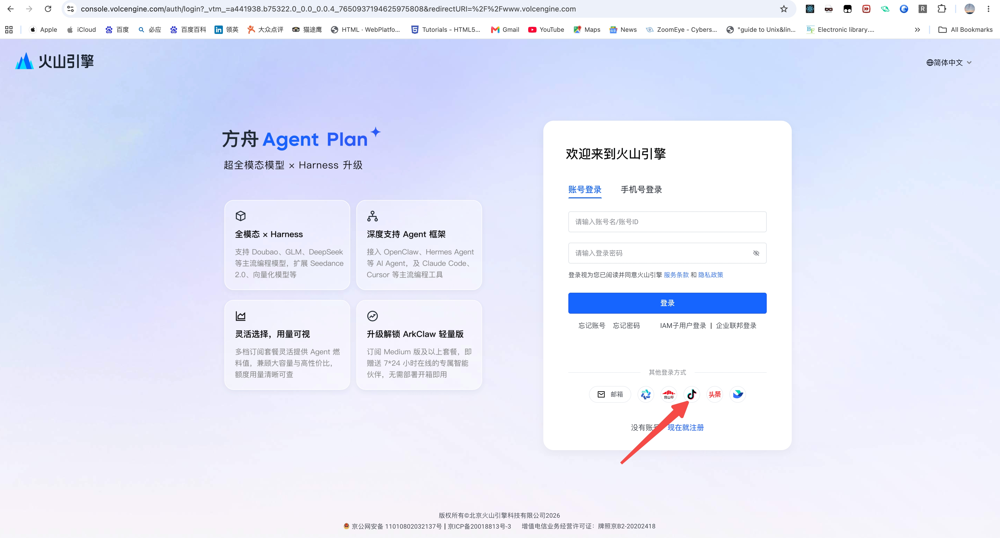

> 如果你习惯用手机号或邮箱登录也可以，这里以抖音登录为例——因为做投流的都有抖音账号，最方便。


### 1.3 完成个人实名认证

1. 登录后进入右上角「账号中心」→「实名认证」
2. 选择「**个人认证**」
3. 填写姓名和身份证号，按提示完成
4. 通常即时通过，最长不超过 1 个工作日

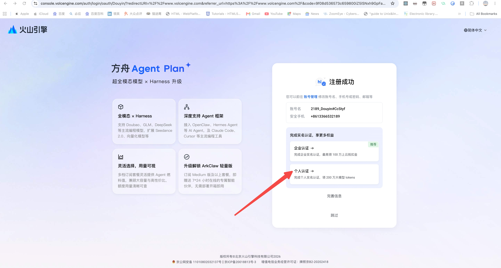


### 1.4 开通 Seedance 2.0 模型服务

1. 登录后，在页面**中间的搜索框**输入「**火山方舟**」，点击搜索结果中的词条中的管理控制台进入
2. 进入火山方舟后，左侧边栏找到「**系统管理**」→ 点击「**开通管理**」

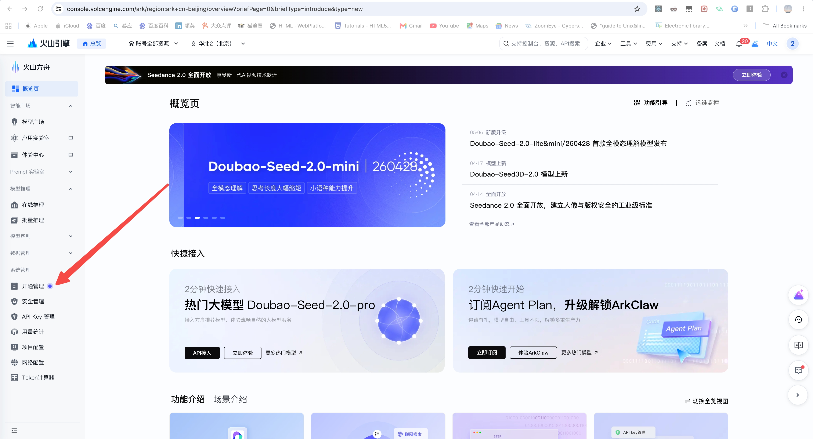

3. 在模型列表中找到「**Doubao-Seedance 2.0**」，点击「**开通**」

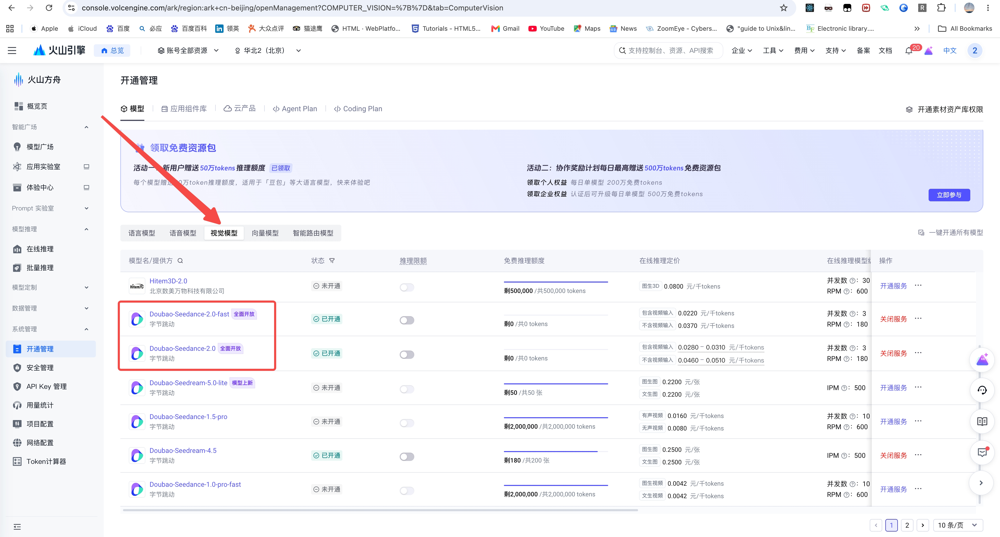

> ⚠️ 开通 Seedance 2.0 需要账户余额 **≥ 200 元**。如果余额不足，先去「费用中心」→「充值」用支付宝或微信充值。这 200 元不是手续费，充值后全部可用于视频生成扣费。


### 1.5 获取 API Key

1. 在方舟控制台左侧菜单中，点击「**API Key 管理**」

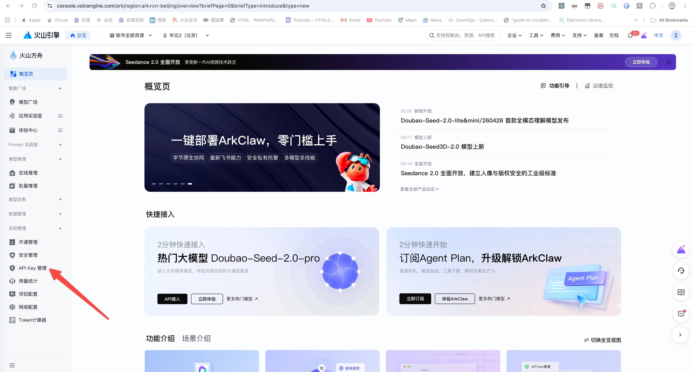

2. 点击「**创建 API Key**」

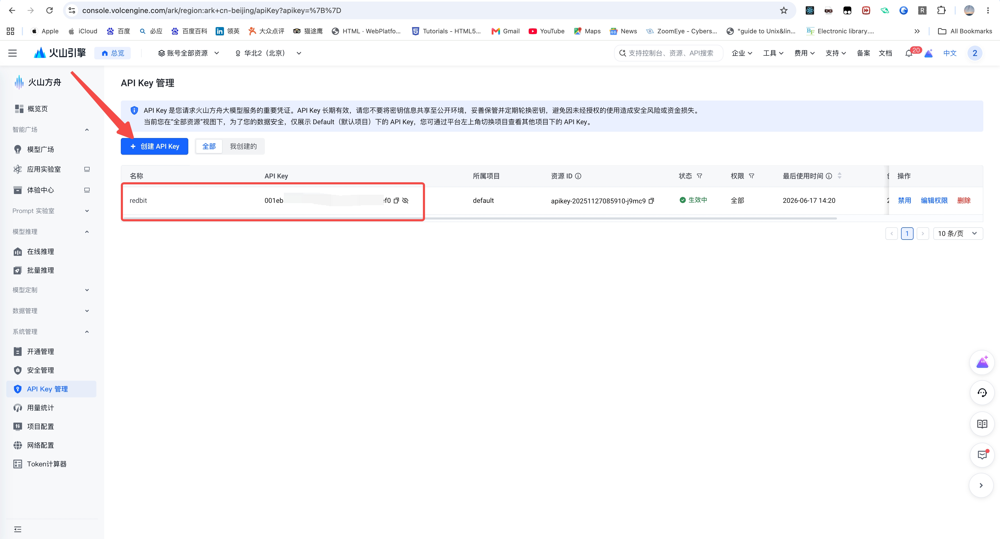

3. 复制生成的 Key，保存到记事本或密码管理工具里

> ⚠️ API Key 等于你的账户密码，不要截图发群里。


### 1.6 费用说明

Seedance 2.0 按 token 量计费，生成多少付多少。官方定价（2026 年 3 月公布）：

- **不含视频输入**（文生视频 / 图生视频 / 多参考）：**46 元 / 百万 tokens**（Standard）、**37 元 / 百万 tokens**（Fast）
- **含视频输入**（视频编辑）：28 元 / 百万 tokens（Standard）、22 元 / 百万 tokens（Fast）

一段 15 秒视频平均消耗约 **30.9 万 tokens**，换算下来：

| 版本 | 清晰度 | 一个 15 秒视频大约花费 |
|------|--------|---------------------|
| **Fast（推荐）** | 720p | 约 **11-12 元** |
| Standard | 720p | 约 **14-15 元** |
| Standard | 1080p | 约 16-17 元 |

> 💡 **Fast 版比 Standard 版便宜约 20%**，且不支持 1080p（最高 720p）。投流视频 720p 完全够用，推荐选 Fast。
>
> 以上费用是付给火山引擎的 API 调用费，由你的火山引擎账户余额扣除。Redbit 不收取任何模型调用费用。
>
> 数据来源：火山引擎官方定价（volcengine.com），2026 年 3 月生效。

---

## 2. 登录 Redbit 并配置模型

> 🔁 这一步也**只做一次**。

### 2.1 打开 Redbit 登录页

在浏览器中打开 Redbit 登录页：[https://www.redbit.one/login](https://www.redbit.one/login)

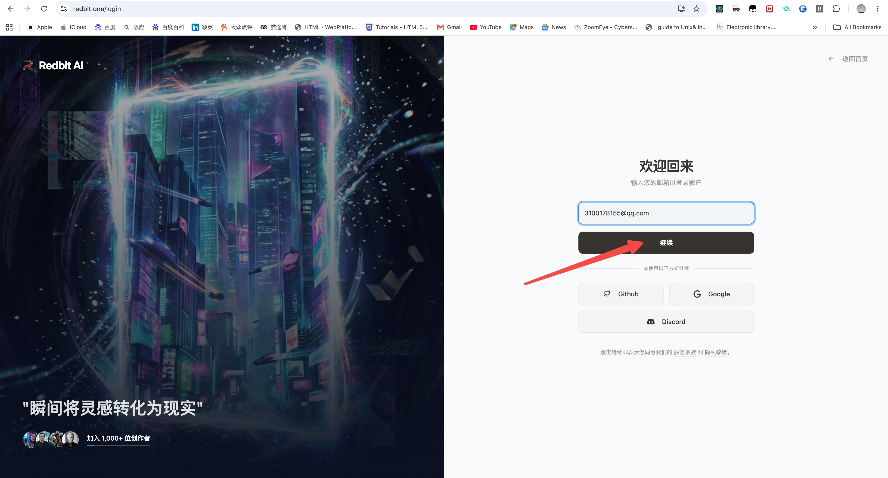


### 2.2 邮箱验证码登录

1. 在右侧表单中输入你的**邮箱地址**
2. 点击「**继续**」按钮
3. 系统发送一封含 8 位验证码的邮件到你的邮箱
4. 打开邮箱，复制验证码
5. 回到 Redbit，粘贴验证码
6. 点击「**验证并登录**」

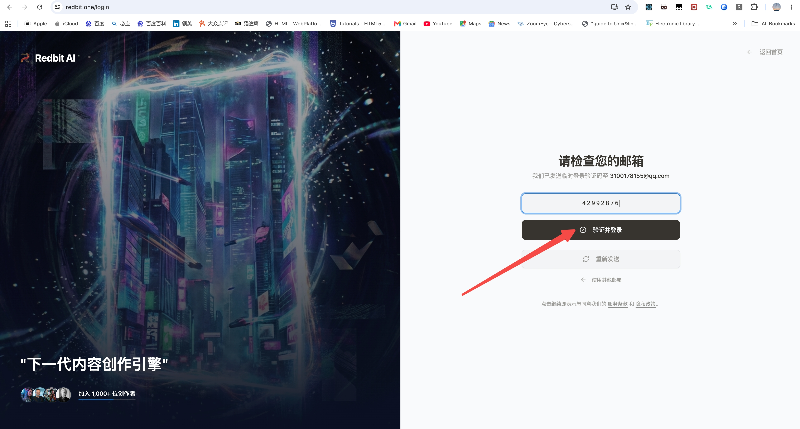


> 💡 页面底部有 Github / Google / Discord 第三方登录按钮，这些是面向海外用户的。大陆用户请使用邮箱验证码方式。

### 2.3 进入 Dashboard

登录成功后自动跳转到 Dashboard 工作台。页面顶部有一排页签：

`反推提示词` | `图片` | `视频` | `音频` | `数字人`


### 2.4 打开设置面板

1. 点击页面右上角的**头像**
2. 在下拉菜单中点击「**设置**」

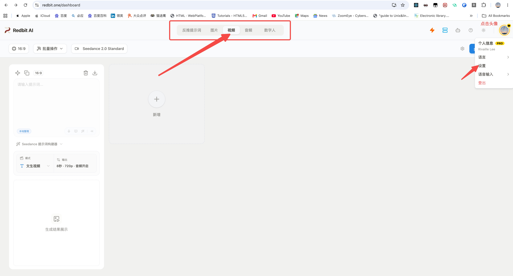


### 2.5 配置视频模型

设置面板从右侧滑出。向下滚动找到「**视频生成设置**」区域（前面有视频图标）。

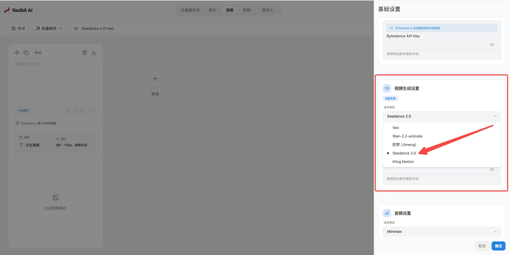

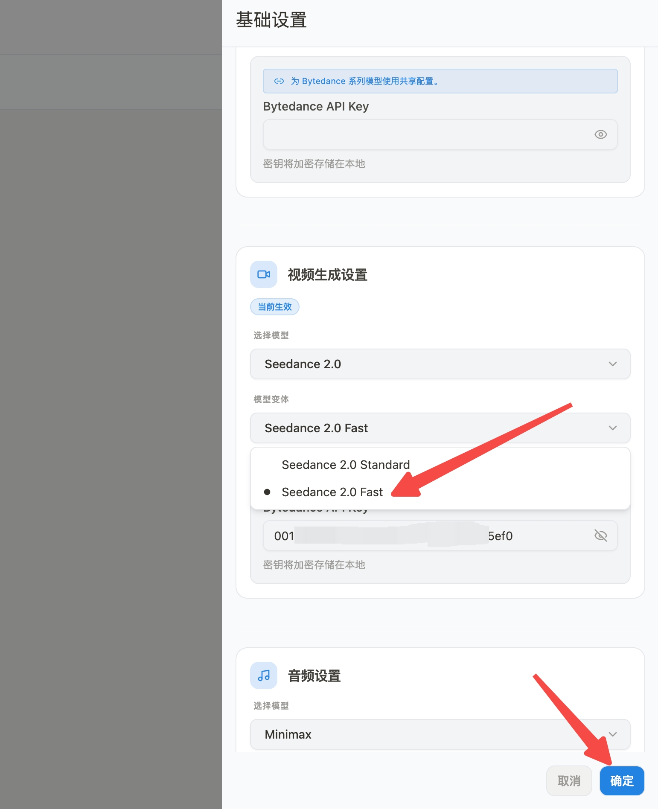

按以下三步操作：

**① 选择模型** → 在模型列表中点击选中「**Seedance 2.0**」


**② 选择变体** → 在「模型变体」下拉框中选「**Seedance 2.0 Fast**」

> Fast 版生成快，推荐 720p。如果场景复杂可以选 Standard 版。


**③ 粘贴 API Key** → 在「API Key」输入框中粘贴第 1.5 步复制的 Key


### 2.6 保存设置

点击面板底部的「**确定**」按钮。


---

## 3. 跟 AI 聊出你的投流文案

> ⭐ 这是决定视频效果最关键的一步。不要跳过，也不要随便写一句就生成。

### 3.1 先想清楚商品卖点

打开 AI 之前，花 30 秒想清楚这几件事（拿笔记下来也行）：

| 想清楚什么 | 填写你的答案 |
|-----------|------------|
| 卖什么商品？ | （如：即食火腿肠，开袋就能吃） |
| 卖给谁？ | （如：18-30 岁上班族和学生，追求方便快捷） |
| 核心卖点是什么？ | （如：开袋即食、独立小包装、高蛋白、多种口味） |
| 能在哪些场景下用？ | （如：办公室零食、户外郊游、出差路上、深夜加餐） |
| 想要什么风格？ | （如：清新活力、干净简约、有食欲感） |

### 3.2 打开 AI 聊天工具

推荐以下两个免费工具（二选一即可，效果不好时可以交叉验证）：

- **豆包**：[doubao.com](https://www.doubao.com)
- **DeepSeek**：[chat.deepseek.com](https://chat.deepseek.com)

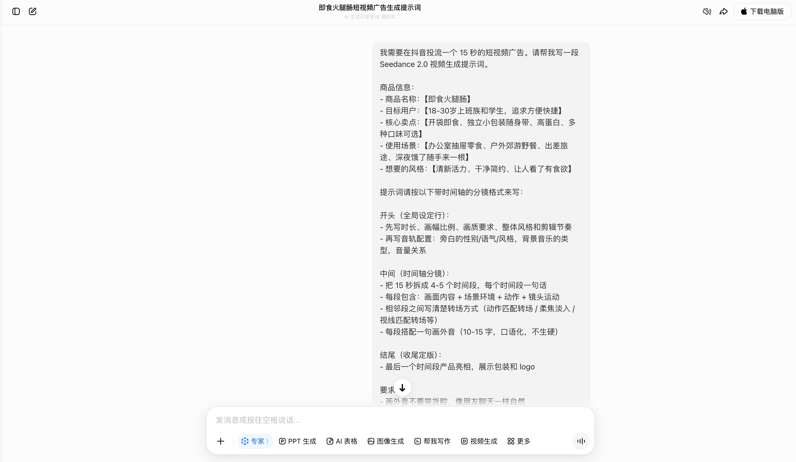

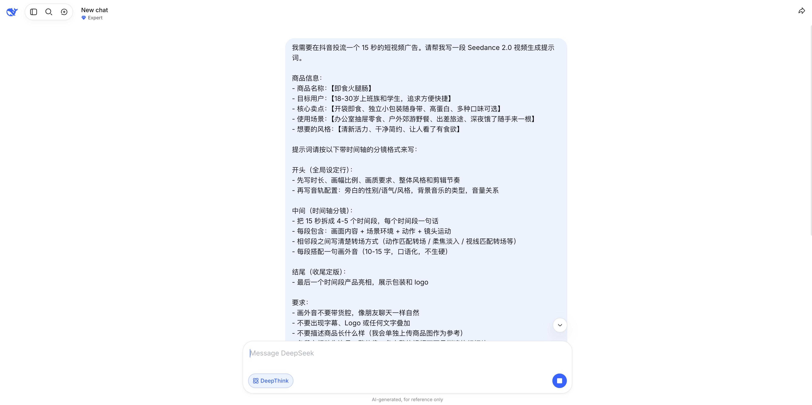

### 3.3 用模板跟 AI 对话 - 【一个简单的示例】

**直接复制下面这段话**，把 `【】` 里的内容替换成你自己的，发给 AI：

```
我需要在抖音投流一个 15 秒的短视频广告。请帮我写一段 Seedance 2.0 视频生成提示词。

商品信息：
- 商品名称：【即食火腿肠】
- 目标用户：【18-30岁上班族和学生，追求方便快捷】
- 核心卖点：【开袋即食、独立小包装随身带、高蛋白、多种口味可选】
- 使用场景：【办公室抽屉零食、户外郊游野餐、出差旅途、深夜饿了随手来一根】
- 想要的风格：【清新活力、干净简约、让人看了有食欲】

提示词请按以下带时间轴的分镜格式来写：

开头（全局设定行）：
- 先写时长、画幅比例、画质要求、整体风格和剪辑节奏
- 再写音轨配置：旁白的性别/语气/风格，背景音乐的类型，音量关系

中间（时间轴分镜）：
- 把 15 秒拆成 4-5 个时间段，每个时间段一句话
- 每段包含：画面内容 + 场景环境 + 动作 + 镜头运动
- 相邻段之间写清楚转场方式（动作匹配转场 / 柔焦淡入 / 视线匹配转场等）
- 每段搭配一句画外音（10-15 字，口语化，不生硬）

结尾（收尾定版）：
- 最后一个时间段产品亮相，展示包装和 logo

要求：
- 画外音不要带货腔，像朋友聊天一样自然
- 不要出现字幕、Logo 或任何文字叠加
- 不要描述商品长什么样（我会单独上传商品图作为参考）
- 各段之间动作连贯，整体像一条完整的视频而不是拼凑的幻灯片
```

### 3.4 AI 给你的回复（示例）

以**即食火腿肠**为例，AI 会返回类似下面这样的提示词：

```
15秒竖屏9:16，高清画质，暖色调生活化质感，轻快紧凑剪辑节奏。全程动作匹配式转场，
画面真实自然，产品包装与品牌标识全程统一（产品如图）。
音轨：年轻亲切的女声旁白，语速轻快自然无带货感；搭配轻量活泼背景纯音乐，
音量低于人声，音画自然融合。

0-3秒 便利店铺货场景
画面：便利店冷藏柜冷白光环境，第一视角。手指伸入货架拿起一包火腿肠，
包装正面logo清晰朝向镜头，指尖轻捏包装动作自然。
画外音：出门随手就能带走的解馋小零食

3-6秒 办公室解馋场景
画面：动作匹配转场至办公工位，暖白光环境。手指轻松撕开包装，肠体饱满油亮。
女生边看电脑边咬下一口，表情惬意满足；桌边放着一杯咖啡，背景虚化突出手部与产品。
画外音：下午犯困来一根，开袋即食超方便

6-9秒 户外郊游场景
画面：柔焦淡入转场，户外草地野餐垫俯拍视角。阳光透过树叶洒落光斑，一只手
从随身包里自然拿出一根火腿肠，撕开包装，轻松享用。
画外音：出门郊游塞几根，随时补充能量

9-12秒 夜间加餐场景
画面：视线匹配转场，温暖居家环境，书桌台灯暖黄光线。一只手从抽屉里拿出
火腿肠，撕开咬下，动作松弛日常。背景是夜间窗户和柔和的室内光。
画外音：深夜饿了随手来一根，高蛋白没负担

12-15秒 产品收尾定版
画面：镜头匀速缓缓推近，浅色台面上整齐摆放几根火腿肠，一根已撕开露出饱满肠体，
其余独立包装完整，品牌logo清晰醒目。暖光均匀打在台面上，画面干净有质感。
画外音：多口味可选，随身携带随时享
```

### 3.5 检查并调优

拿到 AI 的回复后，对照这个清单快速检查：

- [ ] 有全局设定行吗？（时长、比例、风格、音轨——放在最开头）
- [ ] 15 秒拆成了 4-5 段吗？每段有明确的时间标记（如 0-3秒、3-6秒）？
- [ ] 每段有画面 + 镜头 + 画外音吗？
- [ ] 相邻段之间有转场描述吗？（动作匹配、柔焦淡入等）
- [ ] 画外音自然吗？（像朋友聊天，不是"限时抢购！买它！"）
- [ ] 最后一段有产品亮相和 logo 吗？
- [ ] 没有描述商品长什么样吗？（外观交给参考图）

如果某项不满足，直接对 AI 说「把 xxx 改成 xxx」，改到满意为止。

> 💡 更多打磨技巧详见[第 8 节](#8-提示词打磨技巧)。

---

## 4. 准备商品参考图

多参考模式需要上传商品图片，让模型知道你卖的是什么。

### 4.1 需要什么样的图

| ✅ 推荐 | ❌ 不推荐 |
|--------|----------|
| 纯色背景的商品图 | 复杂背景、看不清商品的海报 |
| 多角度展示（正面、侧面、细节） | 只有一张模糊截图 |
| JPG 或 PNG 格式 | 其他格式可能不支持 |
| 2-4 张即可 | 太多不会明显提升效果 |
| 不含真人脸的纯商品图 | 带真人模特的照片（合规原因不支持） |

> ⚠️ Seedance 2.0 出于肖像权合规要求，**不支持上传含真人脸的图片**。如果你的素材是模特上身图，请换成平铺图、假人台图或纯产品图。


### 4.2 保存到电脑

把选好的 2-4 张图放到桌面或一个容易找到的文件夹里。

---

## 5. 创建视频卡片并生成

回到 Redbit 开始实际生成。

### 5.1 切换到视频页签

在顶部页签栏点击「**视频**」。

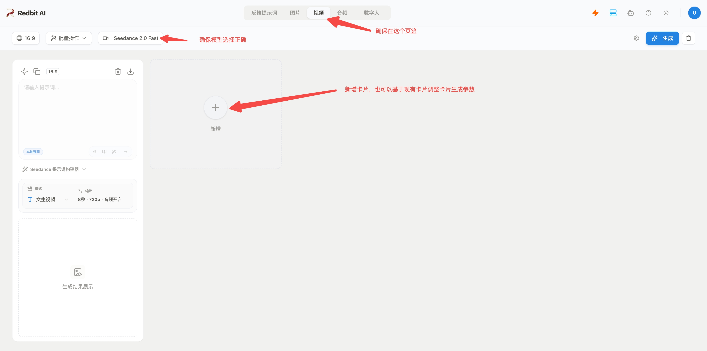


### 5.2 新建视频卡片

在卡片区域找到带 **＋号**的虚线卡片（写着「添加新卡片」），点击它。


### 5.3 确认模型

卡片创建后，顶部工具栏会显示当前模型。确认显示的是 **Seedance 2.0**。如果不是，说明第 2 步设置没生效，回到设置重新选择模型并保存。


### 5.4 选择「多参考」模式

卡片中间会出现 Seedance 视频面板。点击模式下拉菜单，选择「**多参考**」。


四种模式的区别：

| 模式 | 适用场景 |
|------|---------|
| 文生视频 | 没有商品图，纯靠文字描述 |
| 图生视频 | 只有 1 张图作为起始画面 |
| 首尾帧 | 有明确的起始画面和结束画面 |
| **多参考** ← 选这个 | **有 1 张或多张商品图作为参考** |

### 5.5 上传商品参考图

在参考素材区域，点击「**添加参考**」按钮，会出来一个资源弹窗，选择上传新资源然后再选择你要使用的参考图。也可以直接拖拽添加，将图片拖拽到参考组件区域即可【推荐】：

1. 从电脑中选择第 4 步准备好的商品图片（可一次选多张）
2. 上传后每张图旁边会出现标签按钮（`@Image1`、`@Image2`……）
3. 点击标签按钮可以把参考标记自动插入到 prompt 中

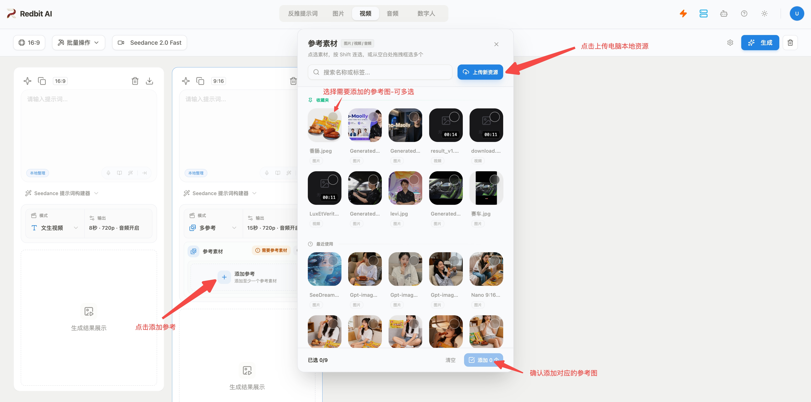


### 5.6 粘贴 Prompt

在卡片上方的 prompt 输入框（灰色提示文字「请输入提示词...」）中，把第 3 步 AI 给你的 prompt **粘贴进去**。


### 5.7 设置输出参数

点击 Seedance 面板顶部右侧的「**输出**」按钮，弹出设置面板后按以下配置：

| 参数 | 选择 | 说明 |
|------|------|------|
| 时长 | **15 秒** | 投流视频 15 秒覆盖信息量刚好 |
| 清晰度 | **720p** | 够用且省钱 |
| 音频 | **开启** | 带环境音更生动 |
| 去除字幕 | **开启** | 避免自动生成无用字幕 |

> 比例在卡片工具栏中设置，确保选的是 **9:16**（竖屏），这是抖音全屏观看的默认比例。

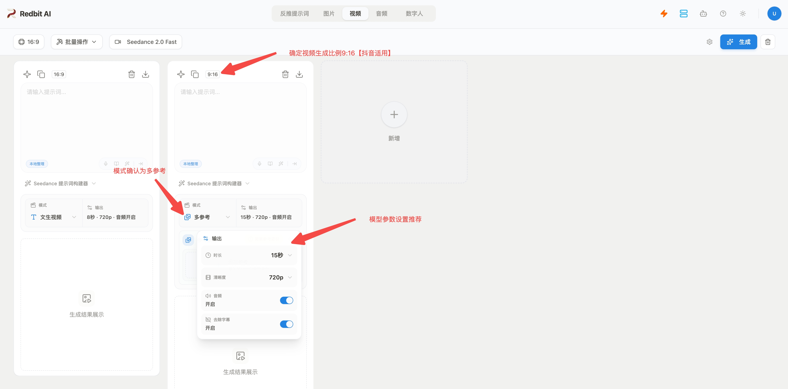

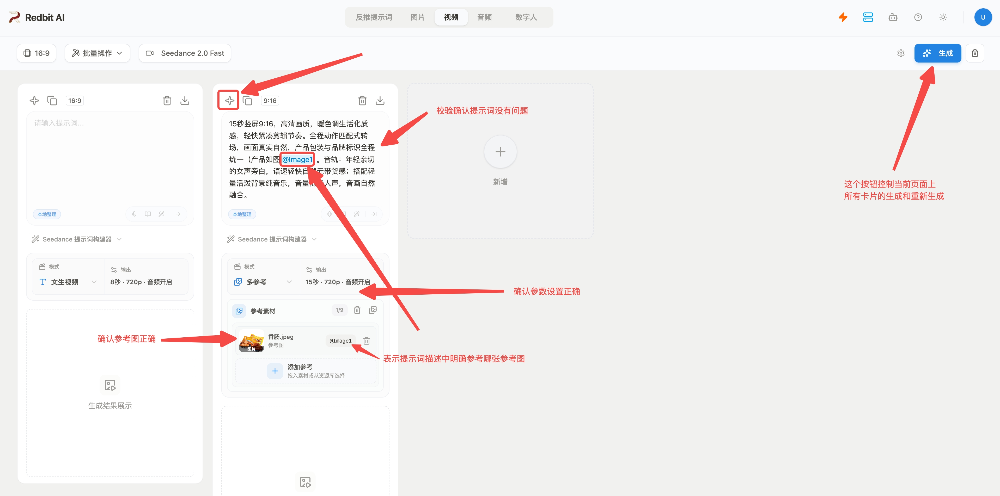

### 5.8 点击生成

一切就绪后，点击卡片**左上角工具栏**中的 **✨ 图标按钮**（生成按钮）。


生成通常需要 **1-3 分钟**，卡片底部会显示加载状态。

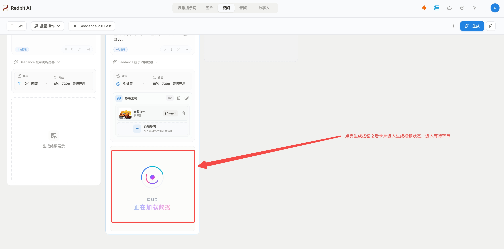

生成完成后，视频出现在卡片下方的结果区域。

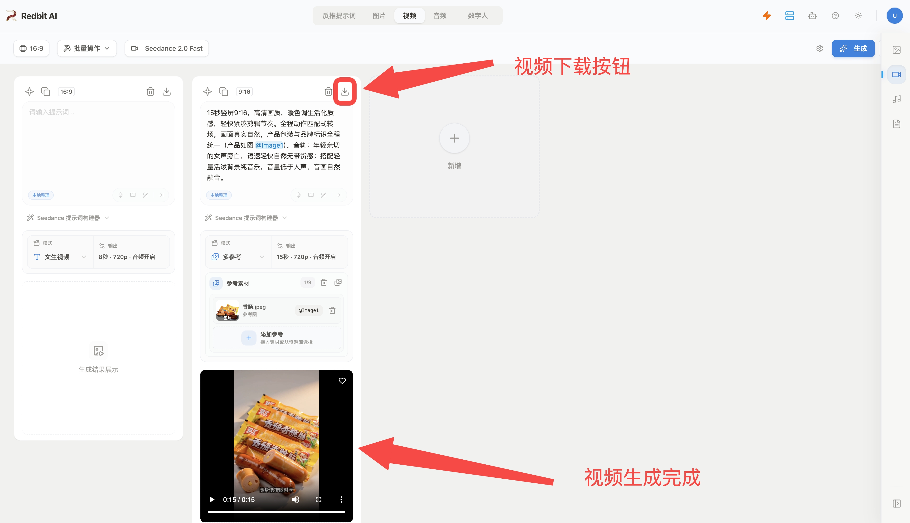

---

## 6. 下载视频到电脑

### 6.1 下载

在卡片**右上角工具栏**中，点击 **下载图标按钮**（向下箭头 ↓），视频即下载到电脑。


下载的 MP4 文件可以直接上传到抖音千川后台投放。

### 6.2 下载不成功？

| 问题 | 解决 |
|------|------|
| 浏览器拦截了下载 | 检查地址栏右侧，允许弹窗 / 下载 |
| 生成还没完成 | 等卡片状态变成成功后再下载 |
| 网络问题 | 刷新页面重试 |

---

## 7. 常见问题

### Q1：生成失败怎么办？

| 错误提示 | 原因 | 解决 |
|----------|------|------|
| unauthorized / 401 | API Key 填错了 | 去设置面板检查 Key，必要时重新生成 |
| 账户欠费 | 余额不足 | 去火山引擎费用中心充值 |
| 未开通模型 | 没在方舟控制台开通 Seedance 2.0 | 去方舟模型广场开通 |
| 等很久没反应 | 生成排队中 | 正常，再等 1-2 分钟 |
| 缺少参考 | 多参考模式需要至少 1 张图 | 上传至少 1 张商品参考图 |
| 视频和商品不像 | 参考图不够清晰或 prompt 描述不准 | 换更清晰的参考图，调整 prompt |

### Q2：fast 版和标准版怎么选？

| 场景 | 选哪个 |
|------|--------|
| 简单场景、单品展示、少运动 | **fast**（快且省钱） |
| 复杂场景、多元素、精细运镜 | **标准版**（画质更高） |
| 不确定 | 先试 fast，不满意再换标准版 |

### Q3：能不能一次生成多条视频挑最好的？

可以。建议每次批量操作 **3-5 张卡片**：

1. 新建 3-5 张卡片，每张填入不同版本的提示词（比如不同风格、不同场景）
2. 分别点击各自的生成按钮
3. 等这批全部完成后（约 1-3 分钟），再启动下一批
4. 从所有结果里挑最好的投放

> 同时提交太多任务可能会触发排队或限流。保持 3-5 张一批比较稳妥，不会卡。

### Q4：生成的视频能商用投放吗？

通过火山引擎官方 API 生成的视频，商用权益按照火山引擎服务条款执行，具体以《服务协议》为准。

### Q5：为什么不能上传带模特的产品图？

Seedance 2.0 出于肖像权合规要求，不允许上传含真人脸的图片。请用平铺图、假人台图或纯产品图。

### Q6：忘记 Redbit 密码怎么办？

Redbit 使用邮箱验证码登录，不需要密码。打开登录页输入邮箱 → 收验证码 → 粘贴即可。

---

## 8. 提示词打磨技巧

> 以下技巧基于 Seedance 2.0 官方指南和实战经验。时间轴分镜格式是 8 秒以上视频的推荐写法。

### 8.1 提示词三段式结构

Seedance 2.0 支持 15 秒多镜头输出，好的提示词应该像一个导演的分镜脚本：

```
【全局设定】时长 + 比例 + 画质 + 风格 + 剪辑节奏 + 音轨配置
【时间轴】  0-Xs：场景 + 画面 + 镜头 + 画外音
           X-Ys：场景 + 画面 + 镜头 + 画外音  （4-5 段）
           ...
【收尾】    最后一段产品亮相 + logo
```

**以火腿肠为例拆解：**

| 部分 | 作用 | 示例 |
|------|------|------|
| 全局设定 | 定下整条视频的基调 | "15秒竖屏9:16，高清画质，暖色调生活化质感，轻快紧凑剪辑节奏。音轨：年轻女声旁白 + 轻量活泼背景音乐" |
| 时间轴分段 | 每段一个场景、一个动作 | "0-3秒 便利店铺货场景：第一视角从货架拿起产品，logo清晰……画外音：出门随手就能带走" |
| 段间转场 | 让段落自然衔接 | "动作匹配转场至……""柔焦淡入转场……""视线匹配转场……" |
| 收尾定版 | 产品亮相，强化记忆 | "12-15秒：镜头缓推，产品整齐摆放，logo清晰，暖光均匀" |

### 8.2 三条核心原则

**原则一：分段要均匀，每段有独立场景**

15 秒拆成 4-5 段最合适（每段 2-4 秒）。不要一段 8 秒、另一段 1 秒——时长悬殊会让节奏失控。每个场景解决一个问题：在哪用、什么时候用、怎么用、效果怎样。

```
推荐拆分：0-3s / 3-6s / 6-9s / 9-12s / 12-15s  （5 段）
```

**原则二：转场方式必须写清楚**

没有转场描述，段与段之间就是硬切，视频会像幻灯片。至少写一种转场方式：

| 转场类型 | 适用场景 |
|---------|---------|
| 动作匹配转场 | 同一个人/手从 A 场景切到 B 场景 |
| 柔焦淡入转场 | 场景切换、光线变化 |
| 视线匹配转场 | 人物视线引导切换到下一场景 |
| 镜头缓推转场 | 产品展示、收尾定版 |

**原则三：画外音对话感，不要广告腔**

Seedance 2.0 生成音频时，旁白的语气由 prompt 里的"音轨配置"行决定。写清楚旁白的性别、语气、语速，并在每一段搭配自然的画外音台词。写完之后自己读一遍——如果读起来像在喊口号，就改。

```
❌ 画外音："限时特惠！买三送一！赶紧下单吧！"
✅ 画外音："下午犯困来一根，开袋即食超方便"
```

### 8.3 三种电商品类时间轴模板

**模板 A：食品 / 零食 / 饮料**

```
15秒竖屏9:16，[画质]，[色调][风格]质感，[节奏]剪辑节奏。全程动作匹配式转场，
画面真实自然（产品如图）。音轨：[性别][语气]旁白 + [音乐类型]背景音乐，音量低于人声。

0-3秒 [钩子场景]
画面：[第一视角/特写]，[从哪里拿出产品]，logo清晰朝向镜头，[动作细节]。
画外音：[一句话点出卖点，10-15字]

3-6秒 [使用场景1]
画面：[转场方式]转场至[场景]，[光线环境]。[使用动作]，[产品效果——饱满/Q弹/油亮]，
[人物反应——满足/惬意]。背景[环境布置]。
画外音：[场景化描述，10-15字]

6-9秒 [使用场景2]
画面：[转场方式]转场至[场景]，[光线环境]。[使用动作]，[产品细节]。
画外音：[场景化描述，10-15字]

9-12秒 [使用场景3]
画面：[转场方式]转场至[场景]，[光线环境]。[使用动作]，动作松弛日常。
画外音：[场景化描述，10-15字]

12-15秒 [收尾定版]
画面：镜头缓推，[台面/背景]上整齐摆放产品，[一根/一件]已打开露出[细节]，
其余独立包装完整，logo清晰醒目。[光线]均匀打在台面上，画面干净有质感。
画外音：[品牌收尾句，10-15字]
```

**模板 B：服饰 / 鞋包 / 配饰**

```
（全局设定行同上，替换对应的风格和音轨描述）

0-3秒 穿搭钩子场景
3-6秒 日常通勤/出街场景
6-9秒 面料/细节特写场景
9-12秒 社交/聚会场景
12-15秒 产品收尾定版
```

**模板 C：数码 / 家电 / 工具**

```
（全局设定行同上，替换对应的风格和音轨描述）

0-3秒 功能钩子场景
3-6秒 使用操作场景
6-9秒 效果展示场景
9-12秒 便携/续航/对比场景
12-15秒 产品收尾定版
```

### 8.4 生成效果不好时怎么办

对照这个表自查，每次只改一个地方：

| 生成效果的问题 | 最可能的原因 | 怎么改 |
|--------------|------------|--------|
| 画面抖动、不连贯 | 没写转场方式，段间硬切 | 每段之间加一个转场描述（动作匹配/柔焦淡入等） |
| 场景切换很突兀 | 时间段太长或太短 | 调整为每段 2-4 秒，均匀分配 |
| 画面跟商品不像 | 参考图不够清晰 | 用更高清的商品图，确保 logo 可辨认 |
| 色调或氛围不对 | 全局设定没写清楚 | 在第一行加上风格、色调、节奏的具体描述 |
| 画外音像机器人念稿 | 没写旁白的语气和风格 | 在音轨配置行加上"年轻亲切""语速轻快""无带货感"等限制 |
| 视频像幻灯片一样硬切 | 没写"全程动作匹配式转场" | 在全局设定行加上转场总体策略 |
| 15 秒只生成了一个场景 | 时间轴写成了一个大段 | 拆成 4-5 个独立时间段，每段不同场景 |

### 8.5 投流视频注意要点

| 要点 | 原因 |
|------|------|
| 前 3 秒有视觉钩子 | 抖音用户第一眼决定划不划走 |
| 每个场景展示一个卖点 | 一条视频覆盖多个使用场景 = 覆盖多类用户 |
| 产品 logo 至少出现 2 次 | 开头一次（建立认知），结尾一次（强化记忆） |
| 段间必须有转场描述 | 无转场 = 幻灯片，有转场 = 一条完整的片子 |
| 画外音读一遍再定稿 | 你自己读着别扭的，模型生成出来更别扭 |
| 外观交给参考图 | 提示词聚焦场景、动作、光线，外观让图片说话 |

---

## 总结：一张图走完全程

```
第1步（一次性）：火山引擎 → 抖音扫码登录 → 个人实名认证 → 充值 ≥200元 → 开通Seedance 2.0 → 获取API Key
         ↓
第2步（一次性）：Redbit → 输入邮箱 → 收验证码 → 登录 → 头像菜单 → 设置
               → 视频模型选Seedance 2.0 fast → 粘贴API Key → 点确定
         ↓
第3步（每次生成）：想好商品卖点 → 打开豆包/DeepSeek → 用模板聊出 prompt → 检查调优
         ↓
第4步（每次生成）：准备2-4张商品参考图（纯产品图，不含真人脸）
         ↓
第5步（每次生成）：视频页签 → +号新建卡片 → 模式选「多参考」
                → 上传参考图 → 粘贴prompt → 设15s/720p/音频开/去字幕开/9:16
                → 点 ✨ 生成
         ↓
第6步（每次生成）：生成完成 → 点 ↓ 下载 → 上传抖音千川 → 投流 🚀
```

> 第一次完整走完约 15-20 分钟。熟练后从第 3 步到第 6 步只需 5 分钟。

---

*本文档版本：v4.0 | 最后更新：2026 年 6 月*
*信息已核实：火山引擎官方定价（2026年3月公布）+ Redbit 应用实际代码（src/）+ Redbit 应用（https://www.redbit.one)*
