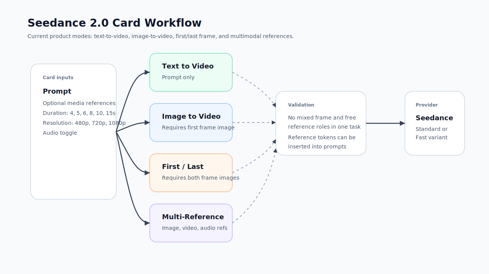

# Seedance 视频工作流

Seedance 是 Redbit 当前模型注册表中的视频模型家族。当活跃卡片是 `video` 卡片，并且所选模型是 `seedance` 或 `doubao-seedance-2.0*` 变体时，dashboard 会显示 Seedance 专属控制项。

## 谁应该阅读本文

当工作流需要 Seedance 专属参考角色、视频生成很慢或失败，或者你需要判断应该使用参考图、首尾帧还是多参考时，读这一页。

## 前置概念

先在 [模型与供应商配置](./model-providers.mdx) 中确认供应商访问。Seedance 请求可以走直接供应商配置或兼容中继；视频生成通常比图像慢，因为供应商可能需要排队、轮询和后处理。

## 当前变体与输出设置

| 设置 | 代码库中的当前值 |
| --- | --- |
| Model ID | `seedance` |
| 变体 | `doubao-seedance-2.0`、`doubao-seedance-2.0-fast` |
| 比例 | `9:16`、`16:9`、`1:1`、`4:3`、`3:4`、`21:9` |
| 时长 | `4`、`5`、`6`、`8`、`10`、`15` 秒 |
| 清晰度 | `480p`、`720p`、`1080p` |
| 默认输出选项 | `720p`、音频开启、web search 默认关闭，除非在卡片设置中修改 |
| 参考媒体角色 | 首帧、尾帧、参考图、参考视频、参考音频 |

## 模式

| 模式 | 必需输入 | 适用场景 |
| --- | --- | --- |
| 文生视频 | 仅 prompt | 没有源帧时，以文字驱动动态创意 |
| 图生视频 | 首帧图片 | 从选定起始图像开始动画化 |
| 首尾帧 | 首帧和尾帧图片 | 在两个固定视觉锚点之间引导过渡 |
| 多参考 | 至少一个图片、视频或音频参考 | 让多种媒体参考共同影响视频任务 |

需要严格控制开头或结尾画面时，用图生视频或首尾帧。需要用图片、视频或音频样例提供更宽泛指导时，用多参考，但要接受供应商对参考和 prompt 的权重可能不同。

## 参考规则

Seedance 的参考处理比普通视频参考更严格：

- 文生视频不使用参考素材；
- 图生视频需要首帧图片；
- 首尾帧模式需要首帧和尾帧图片同时存在；
- 多参考模式至少需要一个参考素材；
- 首尾帧类角色不能和自由多模态参考角色混在同一个任务里；
- 收集参考后，可以在 prompt 中插入 `@image1` 或 `@video1` 等参考 token。

## 推荐流程

<Steps>
  <Step title="配置供应商访问">
    在 Settings 中配置 Seedance 直接凭证或兼容中继。Seedance 的注册表项当前列出 `wavespeed` 和 `other` 作为中继选项。
  </Step>
  <Step title="创建视频卡片">
    打开 `Video` 标签，选择 Seedance，并确认变体、比例、时长、清晰度和音频设置。
  </Step>
  <Step title="选择模式">
    无参考素材时用文生视频；有起始图时用图生视频；需要固定过渡时用首尾帧；需要混合媒体约束时用多参考。
  </Step>
  <Step title="添加参考素材">
    上传素材或从素材码头/SmartPicker 选择。检查每个素材的角色是否符合当前模式。
  </Step>
  <Step title="生成并评审">
    视频生成通常比图片生成更慢，因为供应商可能需要排队、轮询和后处理。
  </Step>
</Steps>

## 排障

| 现象 | 常见原因 | 检查项 |
| --- | --- | --- |
| 提示缺少首帧 | 图生视频没有首帧参考 | 添加图片，并保持角色为 `first_frame` |
| 提示缺少尾帧 | 首尾帧模式只有一个端点帧 | 同时添加首帧和尾帧图片 |
| 提示参考混用错误 | 首尾帧参考和自由参考混在一起 | 要么使用首尾帧角色，要么使用多参考角色，不要混用 |
| 供应商报错 | 凭证、中继能力、端点、额度或模型变体不匹配 | 重新检查 Settings 和供应商控制台 |
| 生成很慢 | 供应商队列或视频设置较重 | 适当缩短时长、降低清晰度，或使用 fast 变体 |

## 下一步

视频失败排查看 [操作检查清单](./checklists.mdx)；面向客户解释视频慢、模型差异或供应商失败时，看 [FAQ 与排障](../faq.mdx)。
